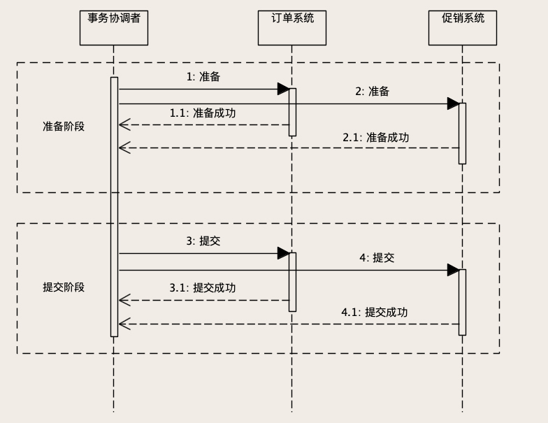

### 存储系统

常见的业务系统很多都是 `MIS系统` -- `管理信息系统`


    -->> 信息数据的管理 
    

`存储`是系统中`最核心`的组成部分， 直接影响系统的速度与稳定性 


### 设计一个电商系统 (`需求分析`)


> 需求分析  --  系统的用户(`给哪些人用`)， 用户用来干什么(`不同的人用来解决什么问题`)


> 使用不同的图 来明确需求


#### `UML (统一建模语言)`中的 `用例图 Use Case`

    1 系统给谁用
    
    2 不同的用户用来解决什么问题
    

 


#### 流程图 


 


####  时序图  (细化流程)


 


####  `UML (统一建模语言)`中的 `包图 package diagram`


 


    
    商品：维护和展示商品信息和价格。
    
    订单：维护订单信息和订单状态，计算订单金额。
    
    购物车：维护用户购物车中的商品。
    
    支付：负责与系统内外部的支付渠道对接，实现支付功能。
    
    库存：维护商品的库存数量和库存信息。
    
    促销：制定促销规则，计算促销优惠。（最复杂 -- 各种活动， 规则计算） 
    
    用户：维护系统的用户信息，注意用户模块它是一个业务模块，一般不负责用户登录和认证，这是两个完全不同的功能。
    
    账户：负责维护用户的账户余额。
    
    搜索推荐：负责商城中，搜索商品和各种列表页和促销页的组织和展示，简单的说就是决定让用户优先看到哪些商品。
   
    报表：实现统计和分析功能，生成报表，给老板来做经营分析和决策使用。
    


###  小规模的订单存储系统


`幂等服务的实现`

#### 订单表的设计


    1  订单主表            保存订单的基本信息
    
    2  订单商品表          保存订单中的商品信息
    
    3  订单支付表          保存 支付， 退款信息 
    
    4  订单优惠表          保存订单使用的优惠券的信息
    
    
     
#### 创建订单 `INSERT` `幂等`

> `防重` --- `幂等操作` -- `一个幂等的创建订单服务`  

使用相同的参数， 多次调用 和 一次调用， 对系统产生的影响是一样的 
    
    任意多次操作的影响 均与 一次执行的影响相同 
    

解决方法:   利用数据库的主键唯一约束

    
        1  先向后端请求获取一个 订单号, 返回给前端 (作为订单数据段饿唯一主键)
        
        2  创建订单的时候， 把订单号传递给后端
        
        3  重复提交会产生 异常
        
       
 

    
####  订单系统的更新服务 `UPDATE`  `ABA与幂等`


也需要`幂等性`


`更新操作` --- `天然幂等`， 但是需要我们注意 `ABA 问题`


`ABA 问题: `

     正常情况:  status -> status1 -> status2 
     
     
     异常情况:  1 status -> status1 （响应超时）

                2 status -> status2  
                
                3 status -> status1 (重试)
                
                最后 status1


> 解决`ABA`问题    `增加版本号(表明请求的先后顺序)`


给订单主表增加一列 `version` , 用来`区分更新请求的时间先后` 


    每次查询订单数据， 把版本号一起返回。
    
    在更新数据的时候， 把版本号作为请求参数， 返回给订单系统
    
    如果版本号一致， 也需要更新操作的时候， 版本号+1
    

`比较版本号`， `更新数据`, `版本号+1` 的操作必须在`同一个事务`里面执行

```sql
update orders set tracking_number = 666, version = version + 1 
where version = 8
```


#### `大数据量`的商品详情页面  `缓存`


> 商品系统需要保存的数据

 


`注意 保存商品的历史版本`


> 1  `商品的基本信息``


`数据库` + `前置缓存`  --- `cached aside策略`


    查询 :          
         1   缓存中有， 直接返回
         2   缓存中没有， 数据库查询， 写入缓存

        
    更新： 
        更新数据库的同时， 把之前的缓存删掉


> 2 使用` Mongo` 保存`商品参数`


`BSON` 更紧凑的 `JSON`


> 3 使用`对象存储 object storage` 保存 `图片, 视频`


数据库 中存储 视频， 图片`ID` 或者 `url`

实际的媒体资源以`文件的形式` 单独存储


    七牛云
    
    AWS 的 S3


`对象存储`可以理解为一个无限容量的 `kv存储`， `存储单位`是 `对象` 

    
    每个对象都有一个key ， 通过这个key可以进行 对应文件的操作
    
    大部分的 云存储服务 都自带CDN （Content Delivery Network） 加速


> 4 将 `商品介绍` -- `静态化`

页面直接生成好， 保存一个静态的`HTML`


    节省服务器资源
    
  
  

  
#### 购物车系统 `临时购物车`


需要考虑的问题:
    
        
        1  如果未登录 -- 临时暂存购物车商品
        
        2  用户登录 -- 把暂存的商品合并到用户的购物车中 ， 并且清除临时暂存的购物车
        
        3  用户登录后 -- 购物车需要在 PC ， app, 小程序等终端保持一致
        
        
  

> 两类购物车 :  `暂存购物车`  + `用户购物车`


- 暂存购物车 -- `客户端`


存储介质 


    Session   不合适    
                    1 保留时间短
                    2 实际还是在服务端
               
                    
    Cookie   
     
              优点
                    实现简单                     
                    服务端可以获取
                    
              缺点 
                    上限 4KB
                    每次请求都会带着， 浪费带宽
                    
    
    LocalStorage    
                
                优点
                    容量大
                    节省带宽
                
                缺点
                    实现复杂
                    只能客户端访问


暂存临时购物车的格式

```json
{
  "cart":[
   {
    "SKUID": 8888,
    "timestamp": 15734335,
    "count": 1,
    "selected": true
  },
   {
    "SKUID": 8889,
    "timestamp": 15734335,
    "count": 1,
    "selected": false
  }
  ]
}
```
                
                
   
- 用户购物车


|列名|数据类型|主键|非空|说明|
|---|---|---|---|---|
|id|BIGINT|是|是|---|
|user_id|BIGINT|---|是|---|
|sku_id|BIGINT|---|是|商品ID|
|count|INT|---|是|商品数量|
|timestamp|DATE|---|是|---|
|selected|TINYINT(1)|---|---|---|


     
`Mysql` 与 `Redis`的比较:

    
    1 性能                  redis > mysql
    
    2 数据可靠性            mysql > redis（丢数据）
    
    3 查询丰富, 事务机制    mysql > redis
    
    


        ```````
#### 账户系统  `事务`


`记录流水` + `核对账户系统与其他系统`


```sql
# 账户余额表
+-----------+----------+------+-----+---------+-------+
| Field     | Type     | Null | Key | Default | Extra |
+-----------+----------+------+-----+---------+-------+
| user_id   | int(11)  | NO   | PRI | <null>  |       |
| balance   | int(11)  | NO   |     | <null>  |       |
| timestamp | datetime | NO   |     | <null>  |       |
| log_id    | int(11)  | NO   |     | <null>  |       |
+-----------+----------+------+-----+---------+-------+


# 流水表
+--------------------------------+----------+------+-----+---------+----------------+
| Field                          | Type     | Null | Key | Default | Extra          |
+--------------------------------+----------+------+-----+---------+----------------+
| log_id                         | int(11)  | NO   | PRI | <null>  | auto_increment |
| amount                         | int(11)  | NO   |     | <null>  |                |
| timestamp                      | datetime | NO   |     | <null>  |                |
| from_system                    | int(11)  | NO   |     | <null>  |                |
| from_system_transaction_number | int(11)  | YES  |     | <null>  |                |
| from_account                   | int(11)  | YES  |     | <null>  |                |
| to_system                      | int(11)  | NO   |     | <null>  |                |
| to_system_transaction_number   | int(11)  | YES  |     | <null>  |                |
| to_account                     | int(11)  | YES  |     | <null>  |                |
| transaction_type               | int(11)  | NO   |     | <null>  |                |
+--------------------------------+----------+------+-----+---------+----------------+
```


>`对账系统`:  注意`账户系统`与其他系统(包括`充值`,`财务`,`交易`, `订单`等)的核对


`技术原因`引起的`对账不准确`：


    网络请求错误
    
    服务器宕机
    
    系统BUG

也即是 `冗余数据的一致性问题`


> 账户系统 `记录流水是必要的`

`账户系统`:  记录余额, 每次交易修改

    user_id
    
    balance
    
    timestamp 
    
    
`流水记录`:  避免账户余额被篡改, 记录BUG, 便于对账

    流水ID
    
    交易金额
    
    交易时间
    
    双方的系统
    
    账户
    
    交易单号
    


记录流水的原则:


    1   流水记录只能 新增， 成功后不允许修改或者删除
    
    2   取消 需要 新增一条 取消的记录
    
    3   流水号是 递增的 
    
    
> 利用`数据库`的`事务 transaction`保证`数据的一致性`


再进行交易的时候  `记录流水` + `修改余额`

    
    保证 记录流水 + 修改余额 同时执行
    
    事务 transaction    


```msql
begin; # 开启事务

insert into account_log ...; # 写入交易流水

update account_balance ...;  # 修改余额

commit;  # 提交事务

```

`ACID` 原则:

- `原子性` Atomic

事务中的操作同时完成 或者 同时失败

    记录流水 修改余额 两个操作要么都成功, 要么都失败（异常退出, 数据库宕机...）
    
    

-  `一致性` Consistency

事务保证读到的数据是一致的

     从一个一致性状态(交易前) --> 到另一个一致性状态(交易后)
     
     

- `隔离性` Isolation  -- `为了实现一致性` 


保证每个事务的执行过程中, 中间状态对其他的事务是不可见的

    
      A事务中写入流水, 如果没有提交
      B事务中看不到 这条流水记录
      

- `持久性` Durability 

事务提交成功之后, 数据会持久化到磁盘中

    
    即使数据库宕机 也不改变事务的结果
    


> 事务的隔离级别


`ACID`是个严格的定义, 全部满足会影响系统的性能


对一般的系统来讲, 满足`原子性`和`一致性`必须要保证


|隔离级别|脏读（DR, dirty read）|不可重复读(NR, NotRepeated Read )|幻读（PR, Phantom Read）|
|---|---|---|---|
|RU `Read Uncommited` 能读到未提交的数据|yes|yes|yes|
|RC `Read Commited` 能读到已提交的数据|no|yes|yes|
|RR `Repeated Read ` 可重复读|no|no|yes|
|Serializable  串行执行|no|no|yes|

    RU              --  完全不隔离, 脏读,  基本不用
    RC              --  不可重复读 (在事务执行中 能读到其他事务对数据的更新)
    RR              --  Mysql 默认, 可重复读 (在事务执行中 不能读到其他事务对数据的更新)
    Serializable    --  隔离性 一致性完好, 性能太差， 基本不用
    
    
    从上往下越来越严格, 性能越差
    


比较 `RC` 与 `RR` 的区别：


两个事务 A , B， A事务执行期间， B事务进行修改操作前后,  

A 事务读到的数据不一样 -- `不可重复读` RC

A 事务读到的数据一样 -- `可重复读`  RR


    在锁方面的区别:
    
        RR需要 gap lock 来解决幻读问题
            RR隔离级别，即使不符合where条件的记录，也不会是否行锁和gap lock；
            
        RC隔离级别则是允许存在不可重复读和幻读的 
            通过 where 条件过滤之后，不符合条件的记录上的行锁，会释放掉(虽然这里破坏了“两阶段加锁原则”)
        
        所以RC的并发一般要好于RR
        
    

如下例:


```sql

# >>>  会话A -- 隔离级别是 RC 

# 获取当前的隔离级别

SELECT @@global.tx_isolation, @@tx_isolation
# mysql8+  select @@global.transation_isolation, @@transation_isolation;
+-----------------------+-----------------+
| @@global.tx_isolation | @@tx_isolation  |
+-----------------------+-----------------+
| READ-COMMITED         | READ-COMMITED |
+-----------------------+-----------------+


begin;

select log_id,amount, timestamp from account_log order by log_id;
+-------+---------+------------+
|log_id | amount  | timestamp  |
+-------+---------+------------+
|3      | 100     | 2020-02-01 |
+-------+---------+------------+

select * from account_balance ; # 账户余额 100
+-------+---------+------------+-------+
|user_id| balance | timestamp  |log_id |
+-------+---------+------------+-------+
|0      | 100     | 2020-02-01 |  3    |
+-------+---------+------------+-------+


# >>>  会话B -- 隔离级别是 RC 

# 对帐户进行转账, 提交事务, 余额变为200

begin;

select log_id, amount, timestamp from account_log order by log_id;
+-------+---------+------------+
|log_id | amount  | timestamp  |
+-------+---------+------------+
|3      | 100     | 2020-02-01 |
+-------+---------+------------+

# 写入流水
insert into account_log values(NULL, 100, NOW(),1, 1001, NULL, 0, NULL, 0, 0 )


# 更新余额
update account balance 
set balance = balance + 100, log_id = LAST_INSERT_ID(), timestamp=NOW()
where user_id = 0 and log_id = 3 

# LAST_INSERT_ID 是和事务session绑定的， 不会有并发问题


# 当前账户有两条流水

select log_id, amount, timestamp from account_log order by log_id;
+-------+---------+------------+
|log_id | amount  | timestamp  |
+-------+---------+------------+
|3      | 100     | 2020-02-01 |
|4      | 100     | 2020-02-01 |
+-------+---------+------------+


# 当前用户的余额是 200
select * from account_balance ; 
+-------+---------+------------+-------+
|user_id| balance | timestamp  |log_id |
+-------+---------+------------+-------+
|0      | 200     | 2020-02-01 |  4    |
+-------+---------+------------+-------+


# A事务没有关闭， 这时候再读, 数据已经与之前的不一样了

# 当前账户有两条流水

select log_id, amount, timestamp from account_log order by log_id;
+-------+---------+------------+
|log_id | amount  | timestamp  |
+-------+---------+------------+
|3      | 100     | 2020-02-01 |
|4      | 100     | 2020-02-01 |
+-------+---------+------------+


# 当前用户的余额是 200
select * from account_balance ; 
+-------+---------+------------+-------+
|user_id| balance | timestamp  |log_id |
+-------+---------+------------+-------+
|0      | 200     | 2020-02-01 |  4    |
+-------+---------+------------+-------+


```

> 幻读 

比如我们在会话 A 中开启一个事务，准备插入一条 ID 为 1000 的流水记录。查询一下当前流水，
不存在 ID 为 1000 的记录，可以安全地插入数据。

```sql
mysql> -- 会话 A
mysql> select log_id from account_log where log_id = 1000;
Empty set (0.00 sec)
```


这时候，另外一个会话抢先插入了这条 ID 为 1000 的流水记录。

```sql

mysql> -- 会话 B
mysql> begin;
Query OK, 0 rows affected (0.00 sec)
mysql> insert into account_log values
    -> (1000, 100, NOW(), 1, 1001, NULL, 0, NULL, 0, 0);
Query OK, 1 row affected (0.00 sec)
mysql> commit;
Query OK, 0 rows affected (0.00 sec)
```
然后会话 A 再执行相同的插入语句时，就会报主键冲突错误，但是由于`事务的隔离性`，
它执行查询的时候，却查不到这条 ID 为 1000 的流水，就像出现了“幻觉”一样，这就是`幻读`。
             


> `RC, RR` 兼顾`并发, 性能和数据一致性`的实现


    1 账户余额增加一个log_id, 记录最后一笔交易的流水号 (类似版本号--幂等--ABA)

    2 开启事务, 查询记录当前余额 和最后一笔交易的流水
    
    3 写入流水记录
    
    4 更新账户余额 (where 条件限制 -- 流水号一致)
    
    5 检查更新操作的返回值, 成功（返回的行数）提交事务
    

完整的SQL:

```sql

mysql> begin;
Query OK, 0 rows affected (0.00 sec)

mysql>  -- 查询当前账户的余额和最后一笔交易的流水号。
mysql> select balance, log_id from account_balance where user_id = 0;
+---------+--------+
| balance | log_id |
+---------+--------+
|     100 |      3 |
+---------+--------+
1 row in set (0.00 sec)

mysql>  -- 插入流水记录。
mysql> insert into account_log values
    -> (NULL, 100, NOW(), 1, 1001, NULL, 0, NULL, 0, 0);
Query OK, 1 row affected (0.01 sec)

mysql>  -- 更新余额，注意where条件中，限定了只有流水号等于之前查询出的流水号3时才更新。
mysql> update account_balance
    -> set balance = balance + 100, log_id = LAST_INSERT_ID(), timestamp = NOW()
    -> where user_id = 0 and log_id = 3;
Query OK, 1 row affected (0.00 sec)
Rows matched: 1  Changed: 1  Warnings: 0

mysql>  -- 这里需要检查更新结果，只有更新余额成功（Changed: 1）才提交事务，否则回滚事务。
mysql> commit;
Query OK, 0 rows affected (0.01 sec)

```

    
    


#### 跨服务和数据库的交易 `分布式事务`

用分布式事务的理论 指导 实际开发

    
    分布式事务的解决方案有很多: 
    
        2PC
        
        3PC
        
        TCC
        
        Saga
        
        本地消息
        
        ...


`分布式事务方法`，其实都是把`一个分布式事务`，拆分成`多个本地事务`。

本地事务可以用`数据库事务`来解决，那分布式事务就专注于解决如何让这些`本地事务保持一致`的问题


> `2PC 二阶段提交`  

    
    优点是强一致，
    
    但是性能和可用性上都有一些缺陷
    

以`订单`与`优惠券`的`数据一致性问题`为例


订单系统：
    
    1 在“订单优惠券表”中写入订单关联的优惠券数据
    
    2 在“订单表”中写入订单数据
    
    (内部可以使用数据库事务来解决 两个操作的一致性问题)
    

促销系统: 

    优惠券的状态   修改 “已使用”
    
    
这两个系统的`数据更新操作保持一致`，`要么都更新成功，要么都更新失败`


`2PC `引入了一个`事务协调者`的角色，来协调`订单系统`和`促销系统`，
协调者对客户端提供一个完整的“使用优惠券下单”的服务，
在这个服务的内部，`协调者再分别调用订单和促销的相应服务`


> `二阶段`:  `准备阶段` + `提交阶段`


- `准备阶段` 


    协调者 分别给 订单系统 和 促销系统 发送“准备”命令，
    
    订单和促销系统收到准备命令之后，开始执行 （准备操作）
    
    订单系统:
    
        在订单库开启一个数据库事务；
        在“订单优惠券表”写入这条订单的优惠券记录；
        在“订单表”中写入订单数据。  
        
        (注意先不提交, 而是返回一个信号给 协调者)
        
        
    
    促销服务：
    
        在促销库开启一个数据库事务，更新优惠券状态
        (注意先不提交, 而是返回一个信号给 协调者)


- `提交阶段`


    协调者再给这两个系统发送“提交”命令，
    
    每个系统提交自己的数据库事务，然后给协调者返回“提交成功”响应，
    
    协调者收到所有响应之后，给客户端返回成功响应
    
    整个分布式事务结束


完整的时序图:




异常处理:

    准备阶段 (回滚各自的事务)：
        
        如果任何一步出现错误或者是超时，协调者就会给两个系统发送“回滚事务”请求。  
        每个系统在收到请求之后，回滚自己的数据库事务，分布式事务执行失败，两个系统的数据库事务都回滚了，
        相关的所有数据回滚到分布式事务执行之前的状态，就像这个分布式事务没有执行一样

    
    提交阶段 （保证成功，不能失败）:
    
        网络传输失败 -- 反复重试，直到提交成功
        
        宕机（包括两个数据库宕机或者订单服务、促销服务所在的节点宕机） -- 导致数据不一致 (小概率--执行过程会很快完成)
        
        


事务协调的服务 （`没有必要单独启动进程`）:

     参与分布式事务的进程更少，故障点也就更少，稳定性更好
     
     减少了一些远程调用，性能也更好一些
    


`2PC 二阶段提交`的`使用场景` 以及 `缺陷`:
    
    使用场景:
        对数据一致性要求比较高的场景 -- 订单优惠券..
    
    缺点:
        性能较差（准备阶段会阻塞事务会话）:
        
            整个事务的执行过程需要阻塞服务端的线程和数据库的会话，所以，2PC 在并发场景下的性能不会很高
        
        协调者是一个单点：
        
            协调者宕机，就会导致订单库或者促销库的事务会话一直卡在等待提交阶段，直到事务超时自动回滚。
           
            卡住的这段时间内, 数据库有可能会锁住一些数据，服务中会卡住一个数据库连接和线程，这些都会造成系统性能严重下降，甚至整个服务被卡住


> `本地消息表` 
    
    
    适用性更加广泛，虽然在数据一致性上有所牺牲，只能满足最终一致性，
    
    有更好的性能，实现简单，系统的稳定性也很好，
    
    是一种非常实用的分布式事务的解决方案
    
    
    优点:
    
        实现简单，在单机事务的基础上稍加改造就可以实现分布式事务
        
        性能非常好，和单机事务的性能几乎没有差别
        
        
        

    

更多的情况下，只要`保证数据最终一致`就可以了。

以`订单`与`购物车`的`数据一致性问题`为例


在购物流程中，用户在购物车界面选好商品后，点击“去结算”按钮进入订单页面创建一个新订单。

    1 创建订单：  订单系统需要创建一个新订单，订单关联的商品就是购物车中选择的那些商品。
    
    2 清空购物车： 创建订单成功后，购物车系统需要把订单中的这些商品从购物车里删掉。


创建订单和清空购物车这两个数据更新操作需要保证，`要么都成功，要么都失败 （一致性）`。


    清空购物车这个操作，它对一致性要求就没有扣减优惠券那么高，
    订单创建成功后，晚几秒钟再清空购物车，完全是可以接受的。
    
    只要保证经过延迟时间后，最终订单数据和购物车数据保持一致就可以了。
    
    
`本地消息表的实现思路` :


    
    1 订单服务
        
        在收到下单请求后，正常使用 订单库的事务 去更新订单的数据，
        
    并在执行这个数据库事务过程中，
    
    2 本地记录一条消息
        
        (这个消息就是一个日志，内容就是“清空购物车”这个操作）
    
    
    让订单库的事务，来保证记录本地消息和订单库的一致性。
    完成这一步之后，就可以给客户端返回成功响应了。
    
    
    3 用一个异步的服务 
        
        去读取刚刚记录的 清空购物车的 本地消息，调用 购物车系统的服务 清空购物车
        
        购物车清空之后，把本地消息的 状态 更新成 已完成
        
        操作失败 :
        
             重试 
            
    保证 订单系统 和 购物车系统  的 数据一致 
    
    
本地消息表的选择:

    存在订单库中 (更简单一些)
    
    用文件的形式 （保存在订单服务所在服务器的本地磁盘中）
 
 

消息队列 `RocketMQ` 提供一种`事务消息`的功能，其实就是`本地消息表思想的一个实现`。

    使用事务消息可以达到和本地消息表一样的最终一致性，相比我们自己来实现本地消息表
    使用起来更加简单，你也可以考虑使用。


`本地消息表`这种方法的 `ACID特性`：

    只能满足 D（持久性） 
    
    A（原子性）C（一致性）、I（隔离性）都比较差
    
    

注意: `本地消息表` 前提条件就是，`异步执行的那部分操作，不能有依赖的资源 `
    
    下单的时候，除了要清空购物车以外，还需要  锁定库存
    
    锁定库存： 
        
        前提是：库存中得有货 
        不然就会出现用户下单成功后，系统的异步任务去锁定库存的时候，因为缺货导致锁定失败
    
        


### 扩容， 单机到分布式

### 海量数据， 与实时性


 


