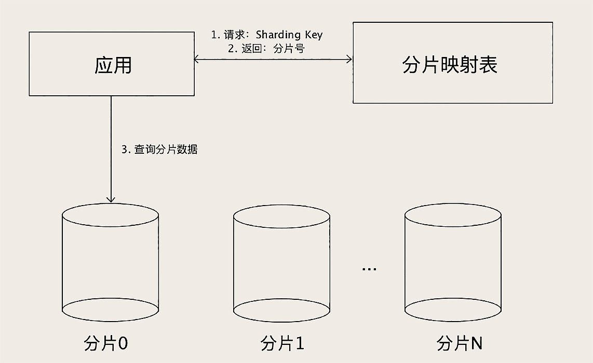

#### `数据库超时`排查


系统基本架构


    系统  托管在 公有云 
    
    1  Nginx 作为前置网关 承接   前端所有请求
    
    2  后端 按照业务，划分了若干个 微服务 分别部署 
    
    3  数据保存在 MySQL 中
    
    4 部分数据用 Memcached  前置缓存
    
    >> 数据并没有按照微服务最佳实践的要求，做严格的划分和隔离，而是为了方便，存放在了一起
 
 
 
异常排查:


 
    1 随着访问量减少，系统能自动恢复，可以排除 后台服务被大量请求打死的可能性
        
         如果进程被打死了，一般是不会自动恢复
        
        
    >>> 重点放在mysql的请求上
    


    
    2  故障时段 MySQL 的 CPU 利用率一直是 100%。
       这种情况下，MySQL 基本上处于一个不可用的状态，执行所有的 SQL 都会超时
       
       MySQL 这种 CPU 利用率高的现象，绝大多数情况都是由  慢 SQL 导致的
       
       
     >>> 优先排查慢 SQL （慢 SQL 日志 -- SQL、执行次数、执行时长）
     
 
<br>
   
    3 定位慢SQL  
    
      排行榜的查询 TOP N 
        
        select fo.FollowId as vid, count(fo.id) as vcounts 
        from follow fo, user_info ui
        where fo.userid = ui.userid
        and fo.CreateTime between
        str_to_date(?, '%Y-%m-%d %H:%i:%s')
        and str_to_date(?, '%Y-%m-%d %H:%i:%s')
        and fo.IsDel = 0
        and ui.UserState = 0
        group by vid
        order by vcounts desc
        limit 0,10
    
    >>> 排行榜的查询，一定要做缓存

 
 缓存增加后
  


 
    4  CPU 利用率，以 20 分钟为周期，非常规律的波动
       总体的趋势与访问量正相关
       
       
    
    


   
    5  
       红线以下的部分，是正常处理日常访问请求的部分，它和访问量是 正相关 的。
       
       红线以上的部分，来自某一个以 20 分钟为周期的 定时任务，和访问量关系不大

    >>> 周期性的 定时任务 
    
    
    红线上部分:
        
        首页聚合了非常多的内容，像精选商品、标题图、排行榜、编辑推荐等等。
        
        这些内容包含了很多的数据库查询。
        
            首页做了一个整体的缓存，缓存的过期时间是  10 分钟
            
            需求不断变化，首页需要查询的内容越来越多，导致查询首页的全部内容越来越慢
            
            刷新一次缓存的时间要 15 分钟, 定时间隔为 10分钟, 所以下次刷新就推迟到了 20 分钟之后，这就导致了上面这个图中，红线以上每 20 分钟的规律波形


    红线下部分增加：
    
        由于缓存刷新慢，也会很多请求无法命中缓存，请求直接穿透缓存打到了数据库上面，
        这部分请求增加了很多 红线以下的部分
        
  
优化效果


 
> 注意点: 

关于 `sql`

    SQL 涉及到的表，它的数据规模 
    
    SQL 可能会遍历的数据量 
    
    尽量地避免写出慢 SQL

    

关于 `缓存`
    
    利用缓存减少数据库查询次数
    
    注意 缓存命中率，要尽量避免请求命中不了缓存，穿透到数据库上

    
    
> 架构层面改进的建议：

    1 上线一个定时监控和杀掉慢 SQL 的脚本
        
        每分钟执行一次，检测上一分钟内，有没有执行时间超过一分钟（这个阈值可以根据实际情况调整）的慢 SQL，如果发现，直接杀掉这个会话
        
    
    2 做一个简单的静态页面的首页作为  降级方案
    
        在 Nginx 上做一个策略，如果请求首页数据超时的时候，直接返回这个静态的首页作为替代。这样后续即使首页再出现任何的故障，也可以暂时降级，用静态首页替代。
        至少不会影响到用户使用其他功能
    
        
        
#### 避免`慢SQL`

`一个慢 SQL` 就可以直接让` MySQL 瘫痪`

    在大多数实际的系统中，慢 SQL 消耗掉的数据库资源，往往是正常 SQL 的几倍、几十倍甚至几百倍


> 定量认识 `Mysql`

`慢 SQL` 对数据库的影响，是一个`量变到质变的过程`


<br>

- MySQL 处理能力


影响 `MySQL 处理能力`的因素:
    
    服务器的配置
    
    数据库中的数据量大小 
    
    MySQL 的一些参数配置 
    
    数据库的繁忙程度
    
    ..
    
    

`MySQL 处理能力`:  每秒`一万条左右`的`简单 SQL`  -- `TPS`

      “简单 SQL”:
       
             指的是类似于 主键查询 这种 不需要遍历很多条记录的 SQL
     
       根据 服务器的配置 高低: 
       
            低端的服务器只能达到每秒几千条
            
            高端的服务器可以达到每秒钟几万条


    正常的系统不可能只有简单 SQL，所以实际的` TPS ` 还要更小
  
  
一般情况下, `数据库繁忙`的定义:
            
            平均每秒钟执行的 SQL 数量在几百左右
       
           一般一台 MySQL 服务器，平均每秒钟执行的 SQL 数量在几百左右，就已经是非常繁忙了，
           即使看起来 CPU 利用率和磁盘繁忙程度没那么高，也需要考虑给数据库“减负”
           

- `慢SQL`的定义：


    SQL 执行(时长) --  不好衡量 
    
            ||
            \/
    
    SQL 执行 (需要遍历的数据行数) 
    
         要避免 百万级, 千万级的查询 SQL的出现
         
         每个 表的数据量 最好小于 千万级别
         
 
  

> 避免`全表扫描`的`索引`


    编写的查询语句，都应该使用索引，避免去遍历整张表，即 避免全表扫描


使用`索引`可以有效地`减少执行查询时遍历数据的行数`，提高查询性能


实际上`数据库的索引`，和编程语言中的 `Map` 或者 `Dictionary` 数据结构都是差不多的

基本上就是各种 `B 树`和 `HASH 表`

  

- 增加索引的`代价`


    降低数据插入、删除和更新的性能
        
         增加了索引，在数据变化的时候，不仅要变更数据表里的数据，还要去变更每个索引


- 根据不同表的需求增加索引

    
    对于 更新频繁, 更新性能要求较高的表   --   少建索引
    
    对于 查询较多, 更新较少的表   --  多建索引

    

> 通过`执行计划` 来 `分析SQL` -- `EXPLAIN`


    rows      MySQL 预估执行这个 SQL 可能会遍历的数据行数
    
    type      查询的访问类型
    
                    ALL      代表全表扫描， 最差的情况
                    
                    range    代表使用了索引，在索引中进行范围查找
                             因为 SQL 语句的 WHERE 中有一个 LIKE 的查询条件
                  
                    index    直接命中索引
    
    key       实际上使用的索引
            
```sql

# 用户表
+-----------------+---------------------+------+-----+---------+----------------+
| Field           | Type                | Null | Key | Default | Extra          |
+-----------------+---------------------+------+-----+---------+----------------+
| id              | bigint(19) unsigned | NO   | PRI | <null>  | auto_increment |
| name            | varchar(50)         | NO   |     | <null>  |                |
| department_code | varchar(50)         | NO   | MUL | <null>  |                |
| status          | tinyint(4)          | NO   |     | <null>  |                |
+-----------------+---------------------+------+-----+---------+----------------+


# 两种查询的比较 


# 1 使用 left 函数
explain SELECT * FROM user WHERE left(department_code, 4) = '1028';

+----+-------------+-------+------------+------+---------------+--------+---------+--------+------+----------+-------------+
| id | select_type | table | partitions | type | possible_keys | key    | key_len | ref    | rows | filtered | Extra       |
+----+-------------+-------+------------+------+---------------+--------+---------+--------+------+----------+-------------+
| 1  | SIMPLE      | user  | <null>     | ALL  | <null>        | <null> | <null>  | <null> | 4    | 100.0    | Using where |
+----+-------------+-------+------------+------+---------------+--------+---------+--------+------+----------+-------------+

--  WHERE 条件中 left 函数对 department_code 这个列做了一个 left 截取的计算，对于表中的每一条数据，都得先做截取计算，然后判断截取后的值，所以不得不做全表扫描


# 尽量不要在 WEHER 条件中，对列做计算


# 2 使用 LIKE
explain SELECT * FROM user WHERE department_code LIKE '1028%';

+----+-------------+-------+------------+------+---------------+--------+---------+--------+------+----------+-------------+
| id | select_type | table | partitions | type | possible_keys | key    | key_len | ref    | rows | filtered | Extra       |
+----+-------------+-------+------------+------+---------------+--------+---------+--------+------+----------+-------------+
| 1  | SIMPLE      | user  | <null>     |range | dep           |dep     | 202    | <null>  | 3    | 75.0     | Using where |
+----+-------------+-------+------------+------+---------------+--------+---------+--------+------+----------+-------------+

-- like '1028%' 可以使用到索引 
-- 因为索引的最左匹配选择，如果%在前面也将无法使用索引
```

#### `SQL` 在数据库中的 `执行过程`


数据库的服务端，可以划分为`执行器 (Execution Engine)` 和 `存储引擎 (Storage Engine)` 两部分

    执行器      负责解析 SQL 执行查询  -- 执行计算
                
                在逻辑层面分析 SQL，优化查询的执行逻辑 
    
    存储引擎    负责保存数据
   

```sql

SELECT u.id AS user_id, u.name AS user_name, o.id AS order_id
FROM users u 
INNER JOIN orders o ON u.id = o.user_id
WHERE u.id > 50

``` 

> `执行器`中  SQL的执行

    收到查询请求  -->  解析 SQL 语句（把文本解析成便于程序处理的结构化数据）(语法解析过程)
    
    -->  转换 结构化数据  --> 抽象语法树 （AST，Abstract Syntax Tree） --> 逻辑执行计划 （优化）
    
    -->  物理执行计划 （优化） -->  完成数据的查询


`AST`概念图


``

```
(1)
LogicalProject(user_id=[$0], user_name=[$1], order_id=[$5]) 
# 做一个 LogicalProject 投影，只保留第 0(user_id)、1(user_name)、5(order_id) 三列，“投影 (Project)”的意思   把不需要的列过滤掉

    LogicalFilter(condition=[$0 > 50]) 
    # 3 然后再执行一个 LogicalFilter 过滤器，过滤条件是第 0 列 (u.id) 大于 50。
    
        LogicalJoin(condition=[$0 == $6], joinType=[inner]) 
        #  2 然后拿这两个表所有数据做一个 LogicalJoin，JOIN 的条件就是第 0 列 (u.id) 等于第 6 列 (o.user_id)
        
        
            LogicalTableScan(table=[users]) 
            LogicalTableScan(table=[orders])
            #  1 最内层的 2 个 LogicalTableScan 的含义是，把 USERS 和 ORDERS 这两个表的数据都读出来


(2) 优化


LogicalProject(user_id=[$0], user_name=[$1], order_id=[$5])
    LogicalJoin(condition=[$0 == $6], joinType=[inner])
        LogicalProject(id=[$0], name=[$1])              // 尽早执行投影
            LogicalFilter(condition=[$0 > 50])          // 尽早执行过滤
                LogicalTableScan(table=[users])
        LogicalProject(id=[$0], user_id=[$1])           // 尽早执行投影
            LogicalTableScan(table=[orders])


```


> `存储引擎`中 SQL 的执行 -- `物理存储结构`


`存储引擎`负责解决 数据库中的`二维表实际上的存储`

    把逻辑的表行列，用 合适的物理存储结构 保存到文件中


`不同的数据库`，它们的`物理存储结构是完全不一样`的，这也是各种`数据库之间巨大性能差距的根本原因`


`MySQL` 非常牛的一点是，它在`设计层面`对`存储引擎`做了抽象，它的存储引擎是`可以替换`的


默认的存储引擎是 `InnoDB`

InnoDB 中，数据表的`物理存储结构`是以`主键为关键字`的 `B+ 树`，`每一行数据`直接就保存在` B+ 树`的`叶子节点`上


    以订单表的主键 orders.id 为关键字组织
    
    其中“62:[row data]”，表示的是订单号为 62 的一行订单数据


表的`索引`也是以 `B+ 树`的方式来`存储`
    
    索引树中，叶子节点保存的不是 行数据，而是行的 主键值
    
    >> 主键不能太长，因为表的每个索引保存的都是主键的值，过长的主键会导致每一个索引都很大
    


- 通过`索引`来`检索一条记录` 

需要先后查询`索引树`和`数据树`这两棵树

    先在 索引树 中检索到行记录的 主键值
    
    然后再用 主键值 去  数据树  中去查找这一行数据
    
    


- SQL  在存储引擎中 执行

    
    优化后的 逻辑执行计划  将会被转换成 物理执行计划
    
            物理执行计划 是和 数据的物理存储结构  相关的


``` 


PhysicalProject(user_id=[$0], user_name=[$1], order_id=[$5])
    PhysicalJoin(condition=[$0 == $6], joinType=[inner])
        InnodbTreeNodesProject(id=[key], name=[data[1]])
            InnodbTreeRangeScan(tree=[users], range=[key > 50])  // 全树扫描再按照主键过滤，直接可以优化为对树的范围查找
        InnodbTreeNodesProject(id=[key], user_id=[data[1]])
            InnodbTreeScanAll(tree=[orders])

#  同样可以根据数据的物理存储结构、是否存在索引以及数据多少等各种因素进行优化

        
PhysicalProject(user_id=[$0], user_name=[$1], order_id=[$5])
    PhysicalJoin(condition=[$0 == $6], joinType=[inner])
        InnodbTreeNodesProject(id=[key], name=[data[1]])
            InnodbTreeRangeScan(tree=[users], range=[key > 50])  // 全树扫描再按照主键过滤，直接可以优化为对树的范围查找
        InnodbTreeNodesProject(id=[key], user_id=[data[1]])
            InnodbTreeScanAll(tree=[orders])    

# 按照优化后的物理执行计划，一步一步地去执行查找和计算，就可以得到 SQL 的查询结果
```
    
- 索引的命中 -- 数据库在对`物理执行计划`优化(识别)

    
    比如: 
        InnoDB 对物理执行计划进行优化的时候，
        
            能识别 LIKE 这种过滤条件，转换为对索引树的范围查找。
            
            不能识别 where left(...)， 全表扫描

#### Mysql 应对 `高并发` -- `缓存` + `读写分离`


> 使用`缓存`保护 Mysql


大多数互联网系统，都使用 `MySQL` +  `Redis` 来解决`高并发请求`

    Redis 作为 MySQL 的前置缓存，可以替 MySQL 挡住绝大部分查询请求, 很大程度上缓解了 MySQL 并发请求的压力。
    

- `更新缓存`的 最佳方式:


Redis （使用内存保存数据的高性能` KV `数据库）的高性能主要来自于:

    简单的数据结构；
    
    使用内存存储数据。

    
数据库   =    执行器    +      存储引擎
    
    
    redis   
            执行器： 非常的薄，所以 Redis 只能支持有限的几个 API，
                     几乎没有聚合查询的能力，也不支持 SQL
                     
            存储引擎：  非常简单，直接在  内存中 用   最简单的数据结构  来保存数据 


从设计上来说，Redis 牺牲了大部分功能，牺牲了`数据可靠性`，换取了`高性能`。

    尽管 Redis 支持将数据持久化到磁盘中，并且还支持主从复制  
    Redis 仍然是一个  不可靠的存储，它在设计上天然就   不保证数据的可靠性


- 如何正确地使用 Redis 做缓存


Key:

在缓存 `MySQL` 的一张表的时候，通常直接选用`主键`来作为 Redis 中的 `Key` 

    比如缓存订单表，那就直接用订单表的 主键订单号  来作为 Redis 中的 key
    
        订单的 Key 加一个统一的前缀，比如 "orders:888888"
        
        

Value:

`序列化`后的整条订单记录

    
     JSON                        可读性比较好
     
    二进制序列化方式             性能更好并且更节省内存


缓存更新策略(1) : `Read/Write Through` -- `并发 脏数据`


    1   对同一条订单记录，同时产生了一个读请求和一个写请求，
        这两个请求被分配到两个不同的线程并行执行，
        读线程尝试读缓存没命中，去数据库读到了订单数据，
        这时候可能另外一个读线程抢先更新了缓存，在处理写请求的线程中，先后更新了数据和缓存，
        然后，拿着订单旧数据的第一个读线程又把缓存更新成了旧数据。
    
    2  两个线程对同一个条订单数据并发写，也有可能造成缓存中的“脏数据”
    

出现`“脏数据”的概率`是和系统的`数据量`以及`并发数量` 正相关的


缓存更新策略(2) : `Cache Aside`  --  `避免脏数据`


    Cache Aside 模式在  更新数据的时候，并不去尝试  更新缓存，而是去  删除缓存
    
    使用 Cache Aside 模式来更新缓存，可以非常有效地避免并发读写导致的脏数据问题。
    


- 避免`缓存穿透` 导致系统雪崩


`缓存穿透`:  在读数据的时候，`没有命中缓存`，请求`“穿透”`了缓存，`直接访问后端数据库`的情况

    
    少量的缓存穿透是正常的
    

要预防 `短时间`内 `大量的请求无法命中缓存`，请求穿透到数据库，导致`数据库繁忙`，请求超时。
`大量的请求超时`还会引发`更多的重试请求`，更多的重试请求让`数据库更加繁忙`， 恶性循环导致`系统雪崩`


- 常见的`缓存穿透` 与 避免方法:


    1 系统初始化的时候 （升级重启，缓存刚上线） 
        
        原因:      缓存是空的，如果大量的请求直接打过来，很容易引发大量缓存穿透导致雪崩
        
        避免方法:   
                    灰度发布 :  先接入少量请求，再逐步增加系统的请求数量，直到全部请求都切换完成
                    
                    缓存预热 ： 系统初始化阶段, 把最经常访问的数据填充到缓存里
       
   
    2  构建缓存数据 需要的查询时间太长 (从数据库中读取数据的时间比较长)
    
        
        原因：      缓存的数据是一个复杂的数据库联查结果,从数据库中读取数据的时间比较长
                   （期间所有的缓存请求都会 穿透， 打到数据库上, 导致数据库繁忙，当请求量比较大的时候就会引起雪崩）
                   
        避免方法:    
                    后台线程来定时更新缓存数据
                    
                    具体分析
                    


>  Mysql `读写分离`

很多情况下 请求的数据 `不适用缓存`， 而且随着系统用户数量越来越多，打到 MySQL 上的读写请求也越来越多，
单台 MySQL 支撑不了大量的并发请求 


`MySQL` 和大部分常用的`关系型数据库`一样，都是典型的`单机数据库`，不支持分布式部署。

用一个单机数据库的多个实例来组成一个集群，提供分布式数据库服务，是非常困难的

    在部署集群的时候，需要做很多额外的工作，而且很难做到对应用透明，应用程序也要为此做较大的架构调整。
    不建议对数据进行分片，自行构建 MySQL 集群，代价非常大
    
    


- 利用 `读写分离` 提升 MySQL 并发


不对数据分片，而是使用 `多个具有相同数据的 MySQL 实例`来`分担大量的查询请求`，这种方法通常称为`“读写分离”`


读写分离之所以能够解决问题的`前提条件`: （`数据的读写比例不均衡`）

    很多系统，特别是面对公众用户的互联网系统，对数据的读写比例是严重不均衡的
    读写比一般都在几十左右，平均每发生几十次查询请求，才有一次更新请求。
    
    数据库需要应对的  绝大部分请求  都是  只读查询请求


- 实施 MySQL 的`读写分离方案`


       1 部署一主多从多个 MySQL 实例，并让它们之间保持数据实时同步。
        
       2 分离应用程序对数据库的读写请求，分别发送给从库和主库
       
            
            分离应用程序的  读写请求方法  有下面这三种：
            
                纯手工方式：     修改应用程序的 DAO 层代码，定义读写两个数据源，指定每一个数据库请求的数据源。
                
                组件方式(推荐)： 也可以使用像 Sharding-JDBC 这种集成在应用中的第三方组件来实现，这些组件集成在你的应用程序内，
                                 代理应用程序的所有数据库请求，自动把请求路由到对应数据库实例上。
                                 
                代理方式：       在应用程序和数据库实例之间部署一组数据库代理实例，比如说 Atlas 或者 MaxScale


读写分离的`实施起来相对比较简单`:

    把使用  单机 MySQL 的系统  升级为   读写分离的多实例架构   非常容易
    
    一般不需要修改系统的业务逻辑 
    
    只需要简单修改 DAO 代码   
    
    把对数据库的读写请求分开 请求不同的 MySQL 实例就可以了


通过`读写分离`这样一个简单的`存储架构升级`，就可以让数据库支持的`并发数量增加几倍到十几倍`。


    系统用户数越来越多，读写分离应该是你首先要考虑的扩容方案


`主库`负责执行应用程序发来的`所有数据更新请求`，然后`异步`将数据变更实时`同步到所有的从库`中去，

    主库和所有从库中的数据是完全一样的。

`多个从库`共同分担应用的`查询请求`


MySQL 自带主从同步的功能，经过简单的配置就可以实现一个主库和几个从库之间的数据同步


`分布式的存储系统`


    分布式写      非常非常困难 -- 很难解决好数据一致性的问题
    
    分布式读      相对简单  -- 增加一些只读的实例，把数据实时的同步到这些只读实例上，保证这这些只读实例上的数据都随时一样，这些只读的实例就可以分担大量的查询请求
    
 
     

- 读写分离的 `数据不一致` -- `主从同步延迟`


数据库中的数据在主库完成更新后，是异步同步到每个从库上的，这个过程有一个微小的时间差，这个时间差叫`主从同步延迟`

    正常情况下，主从延迟非常小，不超过 1ms


    实例1 : 
    
        用户从购物车里发起结算  创建订单，进入订单页，打开支付页面进行支付，支付完成后，按道理应该再返回支付之前的订单页。
        
            但如果这个时候马上自动返回订单页，就很可能会出现订单状态还是显示“未支付”。    
            因为，支付完成后，订单库的主库中，订单状态已经被更新了，而订单页查询的从库中，这条订单记录的状态有可能还没更新
            
        规避:
               增加了一个无关紧要的“支付完成”页面  规避了主从同步延迟的问题
             
  
    实例2 : 
            
        更新了购物车, 重新计算总价
            
            调用计价服务 -->  读购物车的从库，非常可能读到旧数据而导致计算的总价错误
        
        
        规避:
            
            把“更新购物车、重新计算总价”这两个步骤合并成一个微服务，然后放在一个 数据库事务中去
            
            除了修改, 同一个事务中的查询操作也会被路由到 主库, 避免主从不一致
            
    
    
    
            
        
    
             

#### `Mysql 主从同步`的实现


无论是复制还是备份恢复，依赖的都是`全量备份`和` Binlog`

    快照 + 操作日志

    全量备份        相当于备份那一时刻的一个数据快照
    
    Binlog          则记录了每次数据更新的变化，也就是操作日志


几乎所有的`存储系统和数据库`，都是用这一套方法来解决`备份恢复和数据复制问题`

    Redis Cluster      全量备份称为 Snapshot        操作日志叫 backlog   复制方式几乎和 MySQL 是一模一样


>  三种复制模式

- 异步复制 （`默认`）

`执行事务操作的线程`不会等`复制 Binlog 的线程`

提交事务和复制这两个流程在不同的线程中执行，互相不会等待，这是`异步复制`

具体的时序: 


    
    MySQL 主库在收到客户端提交事务的请求之后，会先写入 Binlog，然后再提交事务，更新存储引擎中的数据，
    事务提交完成后，给客户端返回操作成功的响应。
    
    同时，从库会有一个专门的复制线程，从主库接收 Binlog，然后把 Binlog 写到一个中继日志里面，再给主库返回复制成功的响应。

    从库还有另外一个回放 Binlog 的线程，去读中继日志，然后回放 Binlog 更新存储引擎中的数据


- 同步复制

    
`时序`和异步复制基本一样， 唯一的区别是，什么时候给客户端返回响应

    异步复制时，主库提交事务之后，就会给客户端返回响应；
    
    同步复制时，主库在提交事务的时候，会等待数据复制到所有从库之后，再给客户端返回响应。
    

同步复制的缺点:
    
      性能很差，因为要复制到所有节点才返回响应；
      
      可用性也很差，主库和所有从库任何一个数据库出问题，都会影响业务。


- 半同步复制 `mysql 5.7+`


    异步复制      事务线程 完全不等 复制响应；
    
    同步复制      事务线程 要等待所有的 复制响应；
    
    半同步复制    介于二者之间，事务线程不用等着所有的复制成功响应，
                                只要一部分复制响应回来之后，就可以给客户端返回了


    半同步复制的方式，它兼顾了异步复制和同步复制的优点。
    
        如果主库宕机，至少还有一个从库有最新的数据，不存在丢数据的风险。
        并且，半同步复制的性能也还凑合，也能提供  高可用保证，从库宕机也不会影响主库提供服务
    

> 半同步复制 的配置参数


- `“rpl_semi_sync_master_wait_no_slave”`

含义是：`“至少等待数据复制到几个从节点再返回”`

    这个数量配置的越大，丢数据的风险越小，但是集群的性能和可用性就越差。
    最大可以配置成和从节点的数量一样，即 同步复制。


- `“rpl_semi_sync_master_wait_point”` 

控制`主库执行事务的线程`，是在提交事务之前（AFTER_SYNC）等待复制，还是在提交事务之后（AFTER_COMMIT）等待复制

    AFTER_SYNC(默认)，也就是先等待复制，再提交事务，这样完全不会丢数据。
    
    AFTER_COMMIT 具有更好的性能，不会长时间锁表，但还是存在宕机丢数据的风险


依然存在的丢数据风险:
    
    主库提交事务的线程等待复制的时间超时了，这种情况下事务仍然会被正常提交。
    并且，MySQL 会自动降级为异步复制模式，直到有足够多（rpl_semi_sync_master_wait_no_slave）的从库追上主库，才能恢复成半同步复制。
    
    如果这个期间主库宕机，仍然存在丢数据的风险
 
 
 
[>> State machine replication 复制状态机](https://en.wikipedia.org/wiki/State_machine_replication)

[>> more](http://lamport.azurewebsites.net/pubs/implementation.pdf)

#### 解决`Mysql 海量数据查找` -- `1 归档历史订单`


`存储系统性能问题`，其实就是`查找快慢的问题`


无论是什么样的存储系统，`一次查询所耗费的时间`决定于:

    1 查找的时间复杂度
    
    
           1.1  查找算法
            
           1.2  存储数据的数据结构 
           
           
           一般都由数据库完成
           
           比如 Mysql InnoDB ， 存储结构     B+ 树 
                                查找算法     树的查找
                                时间复杂度   O(logN)
    
                
    
    2  数据总量
    

    
    所以一般情况下, 我们可以优化的，就是 数据总量
    
    
>  解决`海量数据`导致存储系统慢问题的思想:

    分片（Shard）  把大数据拆分成 N 个小块
    
            拆开之后，每个分片里的数据就没那么多了，然后让查找尽量落在某一个分片上，
            
            来提升查找性能


电商中的订单数据, 具备`时间属性`， 随着系统运行，`数据量越来越多`， 响应就会越来越慢
    
当单表的订单数据太多，多到影响性能的时候，首选的方案是`归档历史订单`


> `归档历史订单` -- `也是一种拆分数据的策略`

    把大量的历史订单  移到 另外一张历史订单表中
    
    新数据的数据量就会少很多，查询速度也就会快很多


时间属性的数据，都存在`热尾效应`：
    
    多数情况下访问的都是最近的数据，但订单表里面大量的数据都是不怎么常用的老数据
    


- 归档历史订单大致流程：


    
    放在闲时去迁移     --  减少服务器压力
   
    迁移之前一定做好备份


    1   创建一个和  订单表  结构一模一样的  历史订单表；
    
    2   把订单表中的  历史订单数据分批查出来，插入到历史订单表中去。
    
            （ 用存储过程、写个脚本或者写个导数据的小程序都行 )
            （如果已经做了主从分离，那最好是去从库查询订单，再写到主库的历史订单表中去，这样对主库的压力会小一点）
        
    3   测试和上线支持历史订单表的新版本代码。
    
            因为两个表都有历史订单，所以现在这个数据库可以支持新旧两个版本的代码，
            如果新版本的代码有 Bug，你还可以立刻回滚到旧版本，不至于影响线上业务。
        
    4   删除订单表中的历史订单数据
            
            等新版本代码上线并验证无误之后，就可以删除订单表中的历史订单数据了。
        
    
    5  定期迁移过期的订单   
            
            还需要上线一个迁移数据的程序或者脚本，定期把过期的订单从订单表搬到历史订单表中去。


> 删除大量数据 -- `批量删除`


```sql

# 1 直接删除   会产生错误
delete from orders where timestamp < SUBDATE(CURDATE(),INTERVAL 3 month);


# 2 批量删除

delete from orders where timestamp < SUBDATE(CURDATE(),INTERVAL 3 month) order by id limit 1000;

# 3 优化

select max(id) from orders where timestamp < SUBDATE(CURDATE(),INTERVAL 3 month);

delete from orderswhere id <= ? order by id limit 1000;


## 排序的作用 -->  因为按 ID 排序后，我们每批删除的记录，基本都是 ID 连续的一批记录，由于 B+ 树的有序性，这些 ID 相近的记录，在磁盘的物理文件上，大致也是放在一起的，这样删除效率会比较高，也便于 MySQL 回收页。

```


如果系统`可以接受暂时停服` -- `非在线迁移`:


```sql


-- 新建一个临时订单表
create table orders_temp like orders;


-- 把当前订单复制到临时订单表中
insert into orders_temp
  select * from orders
  where timestamp >= SUBDATE(CURDATE(),INTERVAL 3 month);


-- 修改替换表名
rename table orders to orders_to_be_droppd, orders_temp to orders;


-- 删除旧表
drop table orders_to_be_dropp


``` 


#### 解决`Mysql 海量数据查找` -- `2 分库分表`


解决`海量数据`的问题，必须要用到`分布式的存储集群` 

因为 `MySQL` 本质上是一个`单机数据库`，所以很多场景下不太适合存 `TB 级别`以上的数据


> 只有 `MySQL` 这类`关系型数据库`，才能提供`金融级的事务保证`


所以这类的 `大数据量`的`订单、支付相关的系统` 还是需要 `Mysql` -- `Mysql 分库分表`


>  如何 `分库分表`


一个原则: `能不拆就不拆，能少拆不多拆`

    数据拆分得越散，开发和维护起来就越麻烦，系统出问题的概率就越大
    
    
`分库, 分表`的目的:


- 1  数据量太大 `查询慢`的问题  -- `数据量大，就分表`


这里面我们讲的“查询”其实主要是`事务中的查询和更新操作`，

    因为 只读的查询 可以通过 缓存和主从分离来解决

    解决查询慢  --  减少每次查询的数据总量 ---  分表


- 2    应对`高并发`  -- `并发高，就分库`

一个数据库实例撑不住，就把`并发请求分散`到多个实例中去，

    


越简单的设计可靠性越高


> 如何选择 `Sharding Key` -- `分表的依据的列或者说是属性`

合适作为分表的依据的列或者说是属性 称为 `Sharding Key` 


    归档历史订单        Sharding Key  -- 订单完成时间
    

分表的依据，取决于`业务如何访问数据`，让查询`尽量落到一个分片中`。


    普通的查询方式:  只是按订单 ID 或者按用户 ID

        订单表:  
                1  订单 ID  -->  Sharding Key
                
                按 订单 ID 来查订单 -->  根据订单 ID 和  分片算法  计算  -->  订单在哪个分片上 (哪个库哪张表)
                -->   再去该分片执行查询
                
                
                2  用户 ID  -->  Sharding Key
                
                在生成订单 ID 的时候，把用户 ID 的后几位作为 订单 ID 的一部分
                
                        比如说，可以规定，18 位订单号中，第 10-14 位是用户 ID 的后四位
                
                这样按订单 ID 查询的时候，就可以根据订单 ID 中的用户 ID 找到分片
    
        
    复杂的查询方式:   订单相关的报表， 店铺自己的订单...
    
                再构建一个以店铺 ID 作为 Sharding Key 的只读订单库，专门供商家来使用
                
                把订单数据同步到 HDFS 中，然后用一些大数据技术来生成订单相关的报表
    


如果分片无法兼容查询，可以把数据同步到其他存储中，供查询


-  `分库分表的缺点`: 会极大地限制数据库的查询能力，之前很简单的查询，分库分表之后，可能就没法实现


    分库分表一定是，数据量和并发大到所有招数都不好使了，我们才拿出来的最后一招
    

> 如何选择`分片算法`: `尽量避免出现热点`


- 基于范围来分片

    
    范围分片      适合          数据量非常大，并发访问量不大      ToB 系统 
            
            （电信运营商的监控系统，采集所有人手机的信号质量，然后做一些分析） 

基于`范围`来`分片`容易产生`热点问题`
    
    对查询 友好
    
    
- 哈希分片算法


    一致性哈希
    
    取模算法
    
        分 24 个分片       用户 ID -> Sharding Key        用户ID / 24  -- 余数就是分片号   （取模算法）
    
    

`哈希分片算法`能够分得`足够均匀`的`前提条件`:   用户 ID 后几位数字必须`均匀分布`
      


- 查表法 -- `人为分配`


决定某个 Sharding Key 落在哪个分片上，全靠人为来分配, `分配的结果`记录在一张表里面, 每次执行查询的时候，先去表里查一下要找的数据在哪个分片中。


优点:

    灵活 
    
    人为地来把数据均匀分配
    
    分片 可以随时改变（变化热点分区）


缺点:
    
    需要二次查询  （性能上也稍微慢一些）
    
         可以通过缓存来加速查询, 实际性能并不会慢很多
        
    
    实现起来更复杂
    
    
    




    
    
    

    
