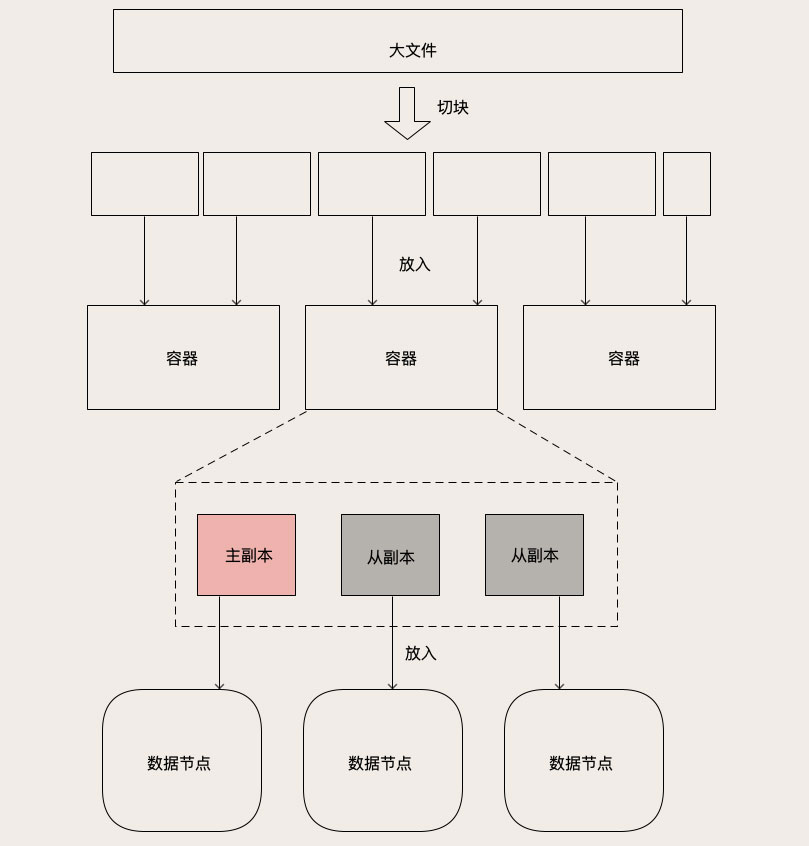
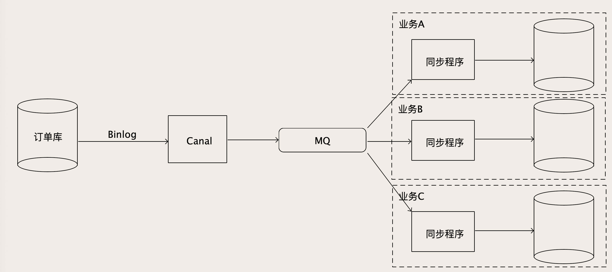

#### `Redis Cluster` 构建`缓存集群`


> Mysql 大数据量的问题解决思路：
    
    数据量太大, 查询慢                 -->  数据分片   ( 存档历史数据,  分库分表 )
    
    并发量太大                         -->  增加实例数 ( 读写分离 )
    
    提供高可用， 防止数据库宕机        -->  主从复制 （增加从节点，主节点宕机的时候用从节点）
    


`Redis` 从 `3.0 版本`开始，提供了官方的`集群支持`，也就是 `Redis Cluser`。

Redis Cluster 相比于`单个节点的 Redis`，能保存更多的数据，支持更多的并发，并且可以做到高可用

在单个节点故障的情况下，继续提供服务。


> 构建一个 生产系统 可用的 Redis 缓存集群：


- `Redis Cluster`  如何分片 

它引入了一个`“槽（Slot）”`的概念，这个槽就是`哈希表`中的`哈希槽`

`槽`是 Redis 分片的`基本单位`，每个槽里面包含一些 `Key`

每个`集群`的`槽数`是固定的 `16384（16 * 1024）`个，每个 Key 落在哪个槽中也是固定的，计算方法是:
    
    HASH_SLOT = CRC16(key) mod 16384
    
    先计算 Key 的 CRC 值，
    然后把这个 CRC 之后的 Key 值直接除以 16384，
    余数就是 Key 所在的槽
    
    哈希分片算法
    


`槽` 如何存放到具体的 `Redis 节点`上:     `分槽的方法--查表法` 

     槽 和 Redis节点 的 映射关系保存在集群的每个 Redis 节点上，
     
     集群初始化的时候，Redis 会自动平均分配这 16384 个槽，也可以通过命令来调整
     
     
Redis Cluster 调用流程：

    客户端 连接集群的任意一个节点 （请求一个 Key）  -->    计算出这个 Key 在哪个槽（哈希分片算法）  -->
    -->   再查询槽和节点的映射关系 （槽和Redis节点的映射关系保存在集群的每个 Redis 节点上）
    -->  找到数据所在的真正节点(本节点--直接返回, 其他节点--给客户端返回一个重定向的命令)
    


扩容与槽的迁移:

Redis Cluster 可以通过`水平扩容`来`增加集群的存储容量` 

每次往集群增加节点的时候，需要从集群的那些老节点中，搬运一些槽到新节点 （`槽数是固定的 `）

    可以手动指定哪些槽迁移到新节点上
    
    也可以利用官方提供的  redis-trib.rb脚本  来自动重新分配槽，自动迁移


- `Redis Cluster`  解决高可用  -- `增加从节点`，做`主从复制`


Redis Cluster 支持`给每个分片 槽`增加`一个或多个从节点`

每个从节点在连接到主节点上之后，会先给主节点发送一个 SYNC 命令，请求一次全量复制，
也就是把主节点上全部的数据都复制到从节点上。

全量复制完成之后，进入同步阶段，主节点会把刚刚全量复制期间收到的命令，以及后续收到的命令持续地转发给从节点。


    直接 转发客户端发来的更新数据命令，来实现主从同步
    

- `Redis Cluster`  应对高并发 


一般来说，Redis Cluster 进行了`分片之后`，每个分片都会承接一部分并发的请求，

加上 Redis 本身单节点的性能就非常高， 所以大部分情况下`不需要再像 MySQL 那样做读写分离`来解决高并发的问题


    默认情况下，集群的读写请求都是由主节点负责的，从节点只是起一个热备的作用
    

Redis Cluster 也支持读写分离，在从节点上读取数据


Redis Cluster 的基本原理:


Redis Cluster 不适合超大规模集群: （适合中小规模`几个到几十个节点`这样规模的 Redis 集群）

        主要原因   它采用了去中心化的设计 (流言 (Gossip) 协议)
            
                好处     去中心化， 部署和维护就更简单，也能避免中心节点的单点故障
                
                缺点     传播速度慢，并且是集群规模越大，传播的越慢
            
        
        
        


> 三种构建 Redis 集群的方式:

-  官方 Redis Cluster: (小规模的集群 )  


- 基于代理的集群架构： (再大一些规模的集群, [twemproxy](https://github.com/twitter/twemproxy) 或者 [Codis](https://github.com/CodisLabs/codis/blob/release3.2/doc/FAQ_zh.md))


在客户端和 Redis 节点之间，还需要增加一层 `代理服务`

    
    1   负责在客户端和 Redis 节点之间转发请求和响应。
        
            客户端只和代理服务打交道，代理收到客户端的请求之后，再转发到对应的 Redis 节点上，
            节点返回的响应再经由代理转发返回给客户端。
    
    2   负责监控集群中所有 Redis 节点状态
    
           如果发现有问题节点，及时进行主从切换。
   
    3   维护集群的元数据
    
            这个元数据主要就是集群所有节点的主从信息，以及槽和节点关系映射表。


    


优点
    
    对客户端透明:                  在客户端视角来看，整个集群和一个超大容量的单节点 Redis 是一样的
    
    分片算法是代理服务控制的:      扩容也比较方便， 直接修改代理服务中的元数据完成扩容

缺点

    增加了一层代理转发:      每次数据访问的链路更长了，必然会带来一定的性能损失
    
    代理服务本身是集群的一个单点


- 定制客户端的方案: (性能更好)


`把代理服务的寻址功能前移到客户端中去`

客户端在发起请求之前，先去查询`元数据`，就可以知道要访问的是哪个分片和哪个节点，
然后直连对应的 Redis 节点访问数据。


    
    缓存 元数据
    
    这个元数据服务仍然是一个单点:     但数据量不大，访问量也不大


#### 保证 `数据库的数据` 和 `redis缓存的数据`一致


`分布式事务` 对`数据更新服务`有很强的`侵入性`
    
    例如:  下单服务  
          
          为了更新缓存增加一个分布式事务
          
              1  无论我们用哪种分布式事务，或多或少都会影响下单服务的性能
              
              2  Redis 本身出现故障，写入数据失败，还会导致下单失败， 降低了下单服务性能和可用性
          


> 方案1: `消息队列` + `更新订单缓存的服务`


启动一个`更新订单缓存的服务`，接收订单变更的 MQ 消息，然后更新 Redis 中缓存的订单数据


注意: 数据可靠性 （`丢消息`）

    MQ 集群，比如像 Kafka 或者 RocketMQ，都有高可用和高可靠的保证机制
    只要正确配置，可以满足数据可靠性要求


> 使用 `Binlog` 实时更新 Redis 缓存


    数据更新服务          只负责处理业务逻辑，更新 MySQL
    
    更新缓存的服务        伪装成一个 MySQL 的从节点， 收 Binlog， 解析 Binlog 之后，可以得到实时的数据变更信息，然后根据这个变更信息去更新 Redis 缓存
    
  
  


    整个缓存更新链路上 减少了一个收发 MQ 的环节
    

有很多开源的项目就提供了`订阅和解析 MySQL Binlog `的功能，下面我们以比较常用的开源项目`Canal`

[>>> Canal](https://github.com/alibaba/canal)

`Canal的工作原理`:


`Canal的使用`:

   
1 下载并解压:

```
wget https://github.com/alibaba/canal/releases/download/canal-1.1.4/canal.deployer-1.1.4.tar.gz
tar zvfx canal.deployer-1.1.4.tar.gz
```

2 配置 MySQL，我们需要在 MySQL 的配置文件中`开启 Binlog`，并设置 Binlog 的格式为 `ROW 格式`
 
    [mysqld]
    log-bin=mysql-bin # 开启Binlog
    binlog-format=ROW # 设置Binlog格式为ROW
    server_id=1 # 配置一个ServerID


3 给 Canal 开一个`专门的 MySQL 用户`并授权，确保这个用户有`复制 Binlog 的权限`:

```sql
CREATE USER canal IDENTIFIED BY 'canal';
GRANT SELECT, REPLICATION SLAVE, REPLICATION CLIENT ON *.* TO 'canal'@'%';
FLUSH PRIVILEGES;
```


4 重启 MySQL，确保所有的配置生效

```mysql

# 重启后检查一下当前的 Binlog 文件和位置

 show master status;
+----------------+----------+--------------+------------------+-------------------+
| File           | Position | Binlog_Do_DB | Binlog_Ignore_DB | Executed_Gtid_Set |
+----------------+----------+--------------+------------------+-------------------+
| bin-log.000018 | 154      |              |                  |                   |
+----------------+----------+--------------+------------------+-------------------+

```

5 记录 `File` 和 `Position` 值， 配置 Canal, 让 Canal 连接到我们的 MySQL


    # canal/conf/example/instance.properties
            
        canal.instance.gtidon=false
        
        
        # position info
        canal.instance.master.address=127.0.0.1:3306
        canal.instance.master.journal.name=bin-log.000018    #  file
        canal.instance.master.position=154                   #  position
        canal.instance.master.timestamp=
        canal.instance.master.gtid=
        
        
        # username/password
        canal.instance.dbUsername=canal
        canal.instance.dbPassword=canal
        canal.instance.connectionCharset = UTF-8
        canal.instance.defaultDatabaseName=test
        # table regex
        canal.instance.filter.regex=.*\\..
    


6  启动 Canal 服务
    
    canal/bin/startup.sh
    
    # 查看日志文件  canal/logs/example/example.log , 确保无异常正常启动
    
    #  Canal 服务启动后，会开启一个端口（11111）等待客户端连接，
       客户端连接上 Canal 服务之后，可以从 Canal 服务拉取数据
       每拉取一批数据，正确写入 Redis 之后，给 Canal 服务返回处理成功的响应。
       如果发生客户端程序宕机或者处理失败等异常情况，Canal 服务没收到处理成功的响应，
       下次客户端来拉取的还是同一批数据，这样就可以保证顺序并且不会丢数据。
    

7  更新服务逻辑

    
    根据 CanalEntry.EventType 类型来分别处理
    
        如果 MySQL 中的数据删除了，就删除 Redis 中对应的数据。
        如果是更新和插入操作，那就调用 Redis 的 SET 命令来写入数据。
        
        if (eventType == CanalEntry.EventType.DELETE) { // 删除
            jedis.del(row2Key("user_id", rowData.getBeforeColumnsList()));
         } 
        else if (eventType == CanalEntry.EventType.INSERT) { // 插入 
            jedis.set(row2Key("user_id", rowData.getAfterColumnsList()), row2Value(rowData.getAfterColumnsList()));
         }
        else { // 更新 
            jedis.set(row2Key("user_id", rowData.getAfterColumnsList()), row2Value(rowData.getAfterColumnsList()));
         }


8   验证mysql 与 redis中数据的一致性

```sql

#  账户余额表插入一条记录
mysql> insert into account_balance values (888, 100, NOW(), 999);

# Redis 缓存

127.0.0.1:6379> get 888
"{\"log_id\":\"999\",\"balance\":\"100\",\"user_id\":\"888\",\"timestamp\":\"2020-03-08 16:18:10\"}"

```


####  `对象存储` 是`（最简单的）`原生的`分布式存储系统` 

`对象存储`不仅有很好的`大文件读写性能`，还可以通过`水平扩展实现近乎无限的容量`，
并且可以`兼顾服务高可用`、`数据高可靠`这些特性

 
原生分布式存储系统（分布式存储集群）
    
    近乎无限的存储容量；
    超高的读写性能；
    数据高可靠：
    节点磁盘损毁不会丢数据；
    实现服务高可用：
    节点宕机不会影响集群对外提供服务。


    MySQL、Redis    单机存储系统 
    
    对象存储        原生分布式存储系统
    

> 对象存储数据 如何保存大文件:


- 数据节点的集群:


    存储节点，用于保存这些大文件
    

- 元数据(管理集群而存储的数据):
    
    
    管理这些数据节点和节点中的文件，还需要一个存储系统保存集群的节点信息、文件信息和它们的映射关系


- 网关集群: 


    对外接收外部请求
    
    对内访问元数据和数据节点





读写请求的流程:


    对象读写请求后 -->> 网关  -->> 根据请求中的 Key，去元数据集群查找这个 Key 在哪个数据节点上 
    -->> 访问对应的数据节点读写数据 -->> 返回结果给客户端 
    
    对象读写请求后 -->> 网关  -->> 根据请求中的 Key，找这个 Key 的元数据 --> 根据元数据中记录的对象长度，计算出对象有多少块儿
    -->>  分块儿并行处理 -->> 需要再去元数据中，找到它被放在哪个容器 (分片算法)  -->> 找到容器之后，再去元数据中查找容器的 N 个副本都分布在哪些数据节点
    -->> 访问对应的数据节点读写数据 -->> 返回结果给客户端 
    
    
    
    
    
    
    

> 对象的拆分和保存

一般来说，对象存储中保存的文件都是`图片、视频这类大文件`


在对象存储中，`每一个大文件`都会被`拆成`多个`大小相等`的`块儿（Block）`

    拆分方法：
    
        把文件从头到尾按照固定的块儿大小，切成一块儿一块儿，最后一块儿长度有可能不足一个块儿的大小，也按一块儿来处理
        
        块儿的大小一般配置为几十 KB 到几个 MB 左右
        
    容器（分片）:
        
        一般都会再把块儿聚合一下，放到块儿的容器里面
        
         容器内的块儿数大多是固定的，所以容器的大小也是固定的
    
             对象被拆成块儿之后，还是太过于碎片化了，如果直接管理这些块儿，会导致元数据的数据量会非常大，
             也没必要管理到这么细的粒度 
     
    副本(物理存在于数据节点上)：
         
        每个容器都会有 N 个副本，这些副本的数据都是一样的     
        
        其中有一个主副本，其他是从副本，主副本负责数据读写，从副本去到主副本上去复制数据，保证主从数据一致

    数据节点: 
        
            运行在服务器上的服务进程
    
拆分成块的目的：
    
       1 提升读写性能     分散到不同的数据节点上，这样就可以(并行读写)
       
       2 便于维护管理 （大小相等）
       
   

#### 跨多系统的`多份数据`实时同步


> 使用 `Binlog` 和 `MQ `构建`实时数据同步系统`


从  `Canal` 出来的 `Binlog 数据`不能直接去写下游那么多数据库

    1  写不过来 
    
    2 对于每个下游数据库，它可能还有一些数据转换和过滤的工作要做。


所以需要增加一个 `MQ` 来`解耦上下游`



    
    1 Canal 从 MySQL 收到 Binlog 并解析成结构化数据之后，直接写入到 MQ 的一个订单 Binlog 主题  
    
    2  然后每一个需要同步订单数据的业务方，都去订阅这个 MQ 中的订单 Binlog 主题，消费解析后的 Binlog 数据。

    3  在每个消费者自己的同步程序中，它既可以直接入库，也可以做一些数据转换、过滤或者计算之后再入库，这样就比较灵活了


> 保证数据同步的实时性（`大促时大数据量`）

大促的时候，数据量大、并发高、数据库中的数据变动频繁

    
    顺着数据流向往下  
            
        订单库                    数据库本身
        
        Canal 和 MQ               没什么业务逻辑，性能都非常好
        
        消费 MQ 的同步程序        
                                
                                
                        注意(每个mysql实例不要并发写入)：
                        
                              保证数据同步过程中的 Binlog 是严格有序的，写到目标数据库的数据是正确的
                              
                              对于每一个 MySQL 实例，整个处理链条都必须是单线程串行执行    
                        
                        
                        
                        1  根据下游同步程序的消费能力，计算出需要多少并发
                        
                        2  设置 MQ 中主题的分区（队列）数量和并发数一致（MQ 可以保证同一分区内，消息不会乱序）
                        
                        3  把具有因果关系的 Binlog 都放到相同的分区中去，保证同步数据的 因果一致性

                                Binlog 中订单号除以 MQ 分区总数，余数就是这条 Binlog 消息发往的分区号                        
                        
                        
                        

`因果一致性（Causal Consistency）`: 

有因果关系的数据之间必须要 `严格地保证顺序`，没有因果关系的数据之间的顺序是无所谓的


Canal 自带的分区策略就支持按照指定的 Key，把 Binlog 哈希到下游的 MQ 中去
