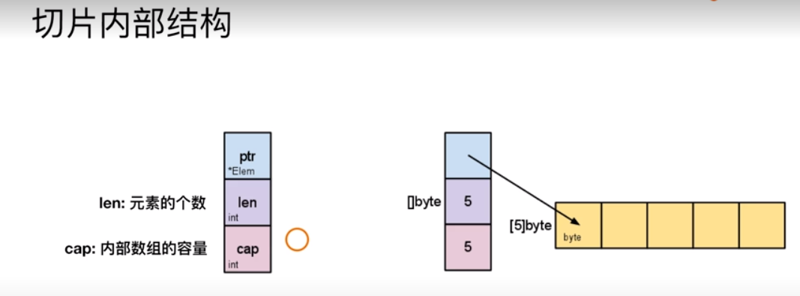
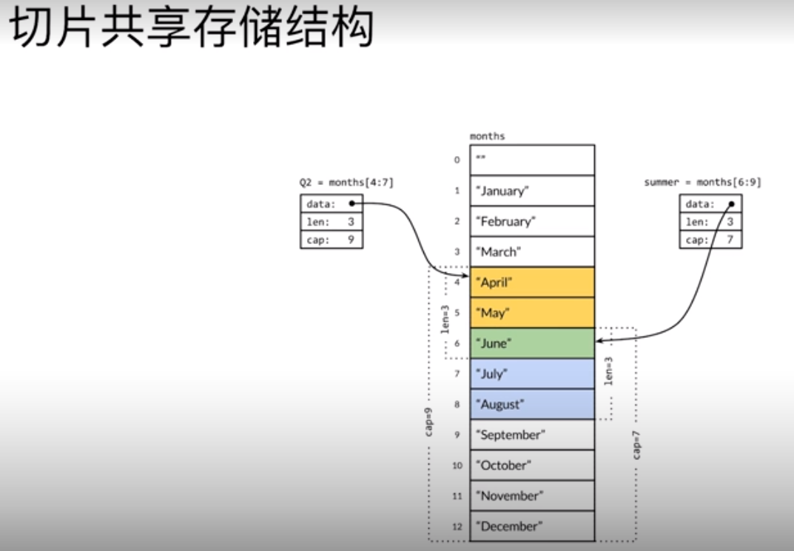

> `go`的诞生是为了解决 `google 内部的问题:`

    
    多核硬件架构
    
    超大规模分布式计算集群
    
    WEB 模式导致的 扩大的开发规模和更新速度
    
    
>  `go`语言的特点

    简单 
        
        关键字：    
                 C     37  
                 go    25
                 C++   87 
                 
        
    
    高效
    
        垃圾回收   +   指针
    
    
    生产力
    
        复合 
  


### 初始化准备 以及 基础概念 


#### 开发环境搭建以及程序入口


> `GOPATH`

    1.8-  需要设置
    
    1.8+  使用默认值
            
            UNIX        $HOME/go
            WINDOWS     %USERPROFILE%/go
            
            MAC  -- 修改 ~/.bash_profile来设置 
            
            
            

> 基本代码结构


```go
package main  // 包， 表示代码所在的模块(包)

import "fmt"  // 引入代码模块

// 功能实现
func main() {
	fmt.Println("hello world!")
}

```              
   
   
>  关于应用程序的入口 


    - 必须是`main包 , package main`
    
    - 必须是`main方法, func main`
    
    - 文件名不一定是 main.go
    


-  关于入口程序退出的返回值 


    go中main函数本身不支持返回值, 需要使用 `os.Exit()`来指定


- 关于入口程序获取命令行参数


    go中main函数不支持传入参数, x幼通过 `os.Args`获取命令行参数
    
#### 变量, 常量


> 编写测试程序 


    文件名:   xxx_test.go 
    
    方法名:    func TestXXX(t *testing.T){...}
    
    
```go 
package try_test

import "testing"

func TestFirstTry(t *testing.T){
	t.Log("my first trial")
}

package fib

import (
	"testing"
)

func TestFibList(t *testing.T){
	var a int = 1
	var b int = 1

	//var(
	//	a int = 1
	//	b int = 1
	//)

	//a := 1     类型推断
	//b := 1
	t.Log(a)
	for i:= 0; i < 6; i++{
		t.Log(b)
		tmp := a
		a = b
		b = tmp + a
	}
}

```

> 变量赋值

    可以进行  类型推断
    
    在一个赋值语句中可以对多个变量进行   同时赋值


```go 

// 变量交换值
func TestChange(t *testing.T){
	a := 1
	b := 2

	t.Log(a, b)

	tmp := a
	a = b
	b = tmp

	t.Log(a, b)

	a, b = b, a

	t.Log(a, b)

}
```


> 常量定义 `go`可以设置连续值`iota`


    
    const (
        Monday = iota + 1
        Tuesday
        Wednesday
        Thursday
        Friday
        Saturday
        Sunday
    )
    
    // bit 位的操作 
    const (
        Open = 1 << iota     第一个比特位为1, 其他为0
        Close                第二位为 1, 其他为0
        Pending              第三位为 1, 其他为0
    )

``` 
package fib

import (
	"testing"
)

const (
	Readable = 1 << iota
	Writable
	Executable
)

func TestConst(t *testing.T){
	a := 7 // 0111
	t.Log(a&Readable==Readable, a&Writable==Writable, a&Executable==Executable)
	// true,  true,  true
	b :=8 // 1000
	t.Log(b&Readable==Readable, b&Writable==Writable,b&Executable==Executable)
    // false,  false,  false
}
```

#### 数据类型


    bool 
    
    string 
    
    int int8 int16 int32 int64
    
    uint unit8 uint16 uint32 uint64   无符号整型
    
    byte  （uint8的一种） 
    
    rune  （int32的一种， 代表Unicode的一种编码值）
    
    float32 float64 
    
    complex64  complex128
    

>  go 不支持`隐式类型转换`

- go 不支持`隐式类型转换` 


        var a int32 = 1 
        var b int64 
        
        b = a 
        cannot use a (type int32) as type int64 in assignment
         

- `别名`和`原有数据类型`也不能进行`隐式的类型转换`

   
        type MyInt int64
        
        var b int64 = 1
        
        var c MyInt
        
        c = b
        cannot use b (type int64) as type MyInt in assignment
 
    
> `指针`使用是`有限制`的

    
    不支持指针运算
    
    string 是值类型， 默认的初始化值是空字符串， 不是nil
    

```go 
package type_test

import "testing"


func TestPoint(t *testing.T){
	a := 1
	aPtr := &a
	t.Log(a, aPtr)      // 1 0xc042008278

	var s string
	t.Log("*" + s + "*" ) // **
}
```

#### 运算符


> 逻辑运算符

   
    &&	逻辑 AND 运算符。 如果两边的操作数都是 True，则条件 True，否则为 False。	(A && B) 为 False
    
    ||	逻辑 OR 运算符。 如果两边的操作数有一个 True，则条件 True，否则为 False。	(A || B) 为 True
    
    !	逻辑 NOT 运算符。 如果条件为 True，则逻辑 NOT 条件 False，否则为 True。	!(A && B) 为 True


> 比较运算符

```go 
package test_compare

import "testing"

func TestCompare(t *testing.T){
	a := [...]int{1, 2, 3}
	b := [...]int{1, 2, 3}
	c := [...]int{2, 3, 4}
	//d := [...]int{1,2}

	t.Log(a == c)
	t.Log(a == b)
	//t.Log(a == d)  数组长度不同
}

```


> 位运算符
    
    &	按位与  
    
    |	按位或  
    
    ^	按位异或  
    
    <<	左移运算符   左移n位就是乘以2的n次方。 其功能把"<<"左边的运算数的各二进位全部左移若干位，由"<<"右边的数指定移动的位数，高位丢弃，低位补0。	A << 2 结果为 240 ，二进制为 1111 0000
    
    >>	右移运算符   右移n位就是除以2的n次方。 其功能是把">>"左边的运算数的各二进位全部右移若干位，">>"右边的数指定移动的位数。	A >> 2 结果为 15 ，二进制为 0000 1111

```go 
package test_compare

import "testing"

func TestCompare(t *testing.T){
	t.Log(6 | 8)  // 按位或     0110   1000  ->   1110
	t.Log(2 ^ 3)  // 按位异或   0010   0011  ->   0001
	t.Log(3 & 4)  // 按位与     0011   0100  ->   0000

}

```


- `按位清零`运算符

`&^`按位清零
    
    右边的操作数    二进制位为   1  左边对应的二进制位都为   0
                    二进制位为   0  左边对应的二进制位   不变
    

```go 
package test_compare

import "testing"

func TestCompare(t *testing.T){
	t.Log(1 &^ 2)  //1        0001    0010  ->   0001 
	t.Log(2 &^ 1)  //2        0010    0001  ->   0010
	t.Log(0 &^ 2)  //0        0000    0010  ->   0000
	t.Log(2 &^ 0)  //2        0010    0000  ->   0010
}

```

#### 条件, 循环

- go 中的`循环`都是用 关键字`for`完成


    
        // while n<6
        for n := 0; n < 6; n++{
            t.Log(n)
        }
        
        
        // while true
        for{
            t.Log("in")
        }


- 条件分支


`if else`

```go 
package test_compare

import "testing"


func someFunc() (res int32, err error) {
	res = 1
	return res, nil
}

func TestIf(t *testing.T){
	if v, err := someFunc(); err != nil{
		t.Log("error")
	}else{
		t.Log(v)
	}

}
```


`switch`


``` 
for i:=0; i<5; i++ {
		switch i {
		case 0, 2: // case后面加多个条件
			t.Log("Event")
		case 1, 3:
			t.Log("Odd")
		}
	}
	

for i:=0; i<10; i++{
		switch {
		case  i % 2 == 0:
			t.Log("event")
		case  i % 2 == 1:
			t.Log("odd")
		default:
			t.Log("unknown")
		}
	}

```

#### 数组与切片


> 数组的声明
    
    
    var a [3]int    // 声明并且初始化为默认值 0 
    a[0] = 1
    
    
    b := [3]int{1, 2, 4}                  // 声明同时初始化   1维数组
    
    c := [2][2]int{{1, 2}, {3, 4}}         // 声明同时初始化  多维数组

    arr3 := [...]int{1, 3, 5, 6, 7}       // 不定长度 
    
    
    
> 数组的遍历


```go 

func TestArrayTravel(t *testing.T){
	arr3 := [...]int{1, 2, 4, 5, 6}
    
    // 常规方式
	for i:=0;i<len(arr3);i++{
		t.Log(arr3[i])
	}

    // for ... range
	for idx, e := range arr3{
		t.Log(idx, e)
	}

    // 使用 _ 占位符
	for _, e := range arr3{
		t.Log(e)
	}
}

```

>  数组的截取

    
    a := [...]int{1, 2, 3, 4, 5}
    
    a[1:2]  // 2 
    a[1:3]  // 2. 3
    a[1:len(a)] // 2, 3, 4, 5
    a[1:]   // 2, 3, 4, 5
    a[:3]   //1, 2, 3
    

> 切片的内部结构 `可变长的数组`




    
    实际是一个结构体 
        
        ptr     --->       连续的存储空间(数组)
        
        len               元素的个数
        
        cap               内部数组的容量
        
        

`初始化`

    var s []int
    s = append(s, 1)    // 添加元素使用 append
                        // 分配新的内存空间, 数据重新拷贝, 赋值
    
    s1 := []int{1, 2, 4}
    
    s2 := make([]int, 3, 5)  // 类型, len, cap
    

> 切片`cap` 的增长规律

```
func TestSliceGrowing(t *testing.T){
	s := []int{}
	for i:=0;i<10;i++{
		s = append(s, i)
		t.Log(len(s), cap(s))
	}
}
    // 每次cap不够用， 增加都是之前的 2倍
	1 1      
	2 2      
	3 4     
	4 4
	5 8
	6 8
	7 8
	8 8
	9 16
	10 16
	
```

> 切片`共享存储空间`




```go 

func TestSliceShareMemory(t *testing.T){
	year := [...]string{"", "Jan", "Feb", "Mar", "Apr", "May", "Jun", "Jul",
		"Aug", "Sep", "Oct", "Nov", "Dec"}

	Q2 := year[4:7]
	t.Log(len(Q2), cap(Q2))  //  3,  9

	Q3 := year[6:9]
	t.Log(len(Q3), cap(Q3))  // 3,  7

	Q3[0] = "unknown"
	t.Log(Q2)              // [Apr May unknown]
	
}
```

> 数组， 切片的对比 

    slice can only be compared to nil

    数组:   容量不可以伸缩
            
            相同容量, 维度的数组可以进行比较

    
    切片:   容量可以伸缩
            slice can only be compared to nil
    
         
         
#### Map


> Map 的声明

    
    m := map[string]int{"one":1, "two":2}
    m1 := map[string]int{}
    
    m2 := make(map[string]int, 10)    // 制定容量
    

> Map 元素的访问 


访问的key不存在时 会返回`零值`而不是空

```go 
m1 := map[int]int{}
t.Log( m1[1])  // 不存在的key , 获取到value是0

if v, ok := m1[1]; ok{
    t.Log("key 1", "exits", v)
}else{
    t.Log("key 1", "not exists")
}
```

> Map 遍历


```go 
m1 := map[int]int{1:2, 2:4, 3:6}
for k, v := range m1{
    t.Log(k, v)
}

// 无序

```

使用`map`实现工厂模式  -- `value 默认值为 函数`

```go 
m1 := map[int]func(op int) int{}

m1[1] = func(op int) int {return op}
m1[2] = func(op int) int {return op*op}
m1[3] = func(op int) int {return op*op*op}

t.Log(m1[1](2), m1[2](2), m1[3](2))

```


使用`map`实现集合 `Set`  -- `value值为bool`

    Map[type]bool
    
    1 元素唯一性
    2 基本操作
        
        添加元素
        判断元素是否存在
        删除元素
        元素个数
        
        
``` 

func TestMapForSet(t *testing.T){
	mySet := map[int]bool{}   // 初始化一个 默认value为false的 map
	mySet[1] = true

	n := 2
	t.Log(mySet[3]) // false
	if mySet[n]{
		t.Logf("%d is existing", n)
	}else{
		t.Logf("%d is not existing", n )
	}
}
```     
    


#### 字符串 `string`


- string 是`数据类型`， 不是  引用或者指针类型


- string 是`只读`的 `byte slice` 
    
    
    len 可以获取所包含的byte数量
    
    
-  string 的 byte数组可以存放任何数据

