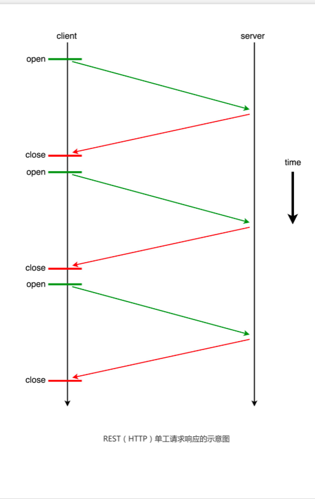
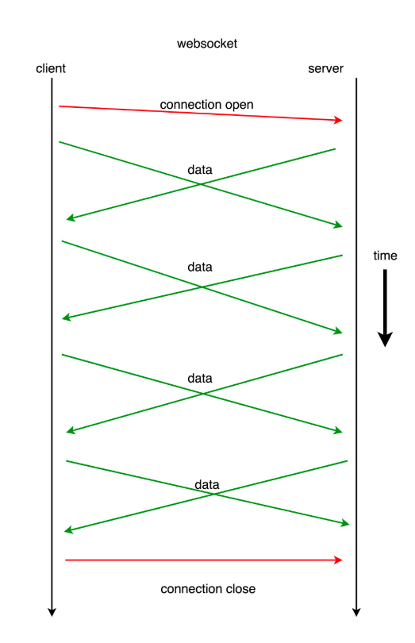
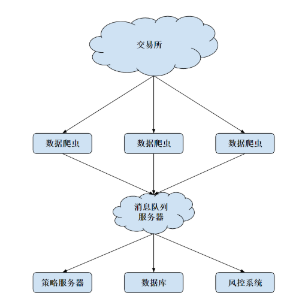

#### REST 简介

REST 的全称是`表征层状态转移`（REpresentational State Transfer）

    指一种 操作资源方法
    


`RESTful 接口`通常以 HTTP `GET `和 `POST` 形式出现。但并非所有的 GET、
POST 请求接口，都是 RESTful 的接口。

    
    GET https://api.gemini.com/v1/pubticker/btcusd 
        
        {"period": "3600"}
    
    
    
         “GET“是动词
        
          URI 是 ticker 这个资源的地址
          
          {"period": "3600"}  参数
        
    
    RESTful 的动词、资源分离原则么，
    

<br>

> 判断 URI 是否指向一个资源（不应该包含动词）

    POST   https://api.restful.cn/accounts/delete/:username
        (非RESTful)
        

    DELETE https://api.rest.cn/accounts/:username
        （RESTful）
        

> `REST 接口`的另一个重要要求：`无状态`


每个 REST 请求都是独立的，不需要服务器在会话（Session）中缓存中
间状态来完成这个请求

    如果服务器 A 接收到请求的时候宕机了，而此时把这
    个请求发送给交易所的服务器 B，也能继续完成
    
    
    
    
#### HTTP request


`HTTP 协议`是互联网中基于 `TCP `的基础协议。

HTTP 协议是 Hyper Text Transfer Protocol（超文本传输协议）的缩写，用于从万维网（WWW:World
Wide Web ）服务器传输超文本到本地浏览器的传送协议。

`TCP（Transmission Control Protocol）`是面向连接的、可靠的、基于字节流的传输层通信协议

    HTTP  主要特点  
    
        连接简单、灵活，可以使用“简单请求，收到回复，然后断开连接”的方式
        
        是一种无状态的协议，（充分符合 RESTful 的思想）
        
  

> 请求的结构


```python
import requests
import json
import base64
import hmac
import hashlib
import datetime
import time
base_url = "https://api.sandbox.gemini.com"
endpoint = "/v1/order/new"
url = base_url + endpoint
gemini_api_key = "account-zmidXEwP72yLSSybXVvn"
gemini_api_secret = "375b97HfE7E4tL8YaP3SJ239Pky9".encode()
# gemini_api_secret 为私钥；而服务端存储着公钥(对请求解密)
t = datetime.datetime.now()

payload_nonce = str(int(time.mktime(t.timetuple())*1000)) # 每个包都增加了一个身份识别
#。当某个后来的请求的 nonce，比上一个成功收到的请求的
# nouce 小或者相等的时候，服务器 便会拒绝这次请求。


# 在一定程度上防止中间人攻击：
#     一则是因为 nonce 的加入，使得加密后的同样订单的加密文本完全混乱；
#     二则是因为，这会使得中间人无法通过“发送同样的包来构造重复订单“进行攻击。

payload = {
"request": "/v1/order/new",
"nonce": payload_nonce,
"symbol": "btcusd",
"amount": "5",
"price": "3633.00",
"side": "buy",
"type": "exchange limit",
"options": ["maker-or-cancel"]
}

# payload 是一个很重要的字典，它用来存储下单操作需要的所有的信
# 息，也就是业务逻辑信息。这里我们可以下一个 limit buy，限价买单，价格为 3633 刀。


# 对 payload 进行 base64 和 sha384 算法非对称加密

encoded_payload = json.dumps(payload).encode()
b64 = base64.b64encode(encoded_payload)
signature = hmac.new(gemini_api_secret, b64, hashlib.sha384).hexdigest()


request_headers = {
'Content-Type': "text/plain",
'Content-Length': "0",
'X-GEMINI-APIKEY': gemini_api_key,
'X-GEMINI-PAYLOAD': b64,
'X-GEMINI-SIGNATURE': signature,
'Cache-Control': "no-cache"
}
response = requests.post(url,
data=None,
headers=request_headers)

new_order = response.json()
print(new_order)
```
          
        
        
           
#### 实时性的数据保证 `websocket`


```python

# 1 普通的 HTTP 请求 （TCP/TSL 套接字（Socket）连接）

# 每一次 REST 请求，通常都会重新建立一次 TCP/TSL 握手；
# 然后，在请求结束之后，断开这个链接。

# TCP handshake: 0.072758s, SSL handshake: 0.119409s
# HTTP请求过程中 ，HTTP 连接构建的过占了很多时间


import requests
import timeit
def get_orderbook():
    orderbook = requests.get("https://api.gemini.com/v1/book/btcusd").json()
    
n = 10
latency = timeit.timeit('get_orderbook()', setup='from __main__ import get_orderbook')
print('Latency is {} ms'.format(latency * 1000))


# 2 
```





`WebSocket` 是一种在`单个 TCP/TSL 连接`上，进行`全双工`、`双向通信`的协议。

WebSocket 可以让`客户端`与`服务器`之间的数据交换变得更加简单高效，
服务端也可以主动向客户端推送数据。

在 WebSocket API 中，浏览器和服务器只需要完成`一次握手`，两者之间就可以直接`创建持久性的连接`，并进行`双向数据传输`。

    在请求的同时也在接受消息， ”全双工“
    
    连续发送的同时，也不断地接受消息
    



```python

import websocket
import thread
# 在接收到服务器发送消息时调用
def on_message(ws, message):
    print('Received: ' + message)
    
# 在和服务器建立完成连接时调用
def on_open(ws):
    # 线程运行函数
    def gao():
    # 往服务器依次发送 0-4，每次发送完休息 0.1 秒
        for i in range(5):
            time.sleep(0.01)
            msg="{0}".format(i)
            ws.send(msg)
            print('Sent: ' + msg)
        # 休息 1 秒用于接受服务器回复的消息
        time.sleep(1)
        # 关闭 Websocket 的连接
        ws.close()

        print("Websocket closed")
    # 在另一个线程运行 gao() 函数
    thread.start_new_thread(gao, ())
    
    
if __name__ == "__main__":
    ws = websocket.WebSocketApp("ws://echo.websocket.org/",
                on_message = on_message,
                on_open = on_open)
    ws.run_forever()

#### 输出 #####
Sent: 0
Sent: 1
Received: 0
Sent: 2
Received: 1
Sent: 3
Received: 2
Sent: 4
Received: 3
Received: 4
Websocket closed


# 没有向服务器发送任何消息，没有任何请求，
# 但是服务器却源源不断地向我们推送数据。比 REST 接口“每请求一次获得一次回
# 复”的沟通方式高效

import ssl
import websocket
import json
# 全局计数器
count = 5
def on_message(ws, message):
    global count
    print(message)
    count -= 1
    # 接收了 5 次消息之后关闭 websocket 连接
    if count == 0:
        ws.close()
    
if __name__ == "__main__":
    ws = websocket.WebSocketApp(
        "wss://api.gemini.com/v1/marketdata/btcusd?top_of_book=true&offers=true",
        on_message=on_message)
    ws.run_forever(sslopt={"cert_reqs": ssl.CERT_NONE})
```


相对于 REST 来说，Websocket 是一种`更加实时、高效`的数据交换方式 

缺点：因为请求和回复是异步的，程序的状态控制逻辑更加复杂


> 实例： Gemini 和交易所 Websocket 接口

```python
import copy
import json
import ssl
import time
import websocket

class OrderBook(object):
    # 专门用来存放与之相关的数据结构。其中的 bids 和 asks 两个字典，用来存储当前时刻下的买方挂单和卖方挂单
    BIDS = 'bid'
    ASKS = 'ask'
    
    def __init__(self, limit=20):
        self.limit = limit
        # (price, amount)
        self.bids = {}
        self.asks = {}
        self.bids_sorted = []
        self.asks_sorted = []
    
    def insert(self, price, amount, direction):
        if direction == self.BIDS:
            if amount == 0:
                if price in self.bids:
                    del self.bids[price]
            else:
                self.bids[price] = amount
                
        elif direction == self.ASKS:
            if amount == 0:
                if price in self.asks:
                    del self.asks[price]
            else:
                self.asks[price] = amount
        else:
            print('WARNING: unknown direction {}'.format(direction))
        
    
    def sort_and_truncate(self):
        # sort
        self.bids_sorted = sorted([(price, amount) for price, amount in self.bids.items
        self.asks_sorted = sorted([(price, amount) for price, amount in self.asks.items
        # truncate
        self.bids_sorted = self.bids_sorted[:self.limit]
        self.asks_sorted = self.asks_sorted[:self.limit]
        # copy back to bids and asks
        self.bids = dict(self.bids_sorted)
        self.asks = dict(self.asks_sorted)


    def get_copy_of_bids_and_asks(self):
        return copy.deepcopy(self.bids_sorted), copy.deepcopy(self.asks_sorted)
        
        
class Crawler:
    def __init__(self, symbol, output_file):
        self.orderbook = OrderBook(limit=10)
        self.output_file = output_file
        self.ws = websocket.WebSocketApp('wss://api.gemini.com/v1/marketdata/{}'.format(""),
                on_message = lambda ws, message: self.on_message)
                # 回调函数 on_message() 是一个类成员函数。因此，应该你注意到了，它的第一个参数是 self，这里如果直接写成 on_message = self.on_ message 将会出错
        self.ws.run_forever(sslopt={'cert_reqs': ssl.CERT_NONE})
        
    def on_message(self, message):
        # 对收到的信息进行处理，然后送给 orderbook
        data = json.loads(message)
        for event in data['events']:
            price, amount, direction = float(event['price']), float(event['remaining'])
            self.orderbook.insert(price, amount, direction)
            
        # 整理 orderbook，排序，只选取我们需要的前几个
        self.orderbook.sort_and_truncate()
        
        # 输出到文件
        with open(self.output_file, 'a+') as f:
            bids, asks = self.orderbook.get_copy_of_bids_and_asks()
            
            output = {
                'bids': bids,
                'asks': asks,
                'ts': int(time.time() * 1000)
                }
            f.write(json.dumps(output) + '\n')

if __name__ == '__main__':
    crawler = Crawler(symbol='BTCUSD', output_file='BTCUSD.txt')
    

###### 输出 #######
{"bids": [[11398.73, 0.96304843], [11398.72, 0.98914437], [11397.32, 1.0], [11396.13, 2
{"bids": [[11398.73, 0.96304843], [11398.72, 0.98914437], [11397.32, 1.0], [11396.13, 2
{"bids": [[11398.73, 0.96304843], [11398.72, 0.98914437], [11397.32, 1.0], [11396.13, 2
{"bids": [[11398.73, 0.96304843], [11398.72, 0.98914437], [11397.32, 1.0], [11396.13, 2
{"bids": [[11398.73, 0.97131753], [11398.72, 0.98914437], [11397.32, 1.0], [11396.13, 2

```

#### `pandas + numpy`  策略分析

```python

# csv 數據格式
# Date	            Symbol	    Open	High	Low	Close	     Volume
# 2019/7/8 0:00 	BTCUSD	11475.07	11540.33	11469.53	11506.43	10.77073088
# 2019/7/7 23:00	BTCUSD	11423	11482.72	11423	11475.07	32.99655899
# 2019/7/7 22:00	BTCUSD	11526.25	11572.74	11333.59	11423	48.93773019


from os import path
import pandas as pd


def assert_msg(condition, msg):
    if not condition:
        raise Exception(msg)


def read_file(filename):
    print()
    file_path = path.join(path.dirname(__file__), filename)

    assert_msg(path.exists(file_path), "文件不存在")

    # 读取 CSV 文件并返回
    return pd.read_csv(file_path,
                       index_col=0,
                       parse_dates=True,
                       infer_datetime_format=True)


BTUSD = read_file('BTCUSD_GEMINI.csv')
assert_msg(BTUSD.__len__() > 0, '读取失败')

print(BTUSD.head())


# 輸出

#                      Symbol      Open      High       Low     Close     Volume
# Date                                                                          
# 2019-07-08 00:00:00  BTCUSD  11475.07  11540.33  11469.53  11506.43  10.770731
# 2019-07-07 23:00:00  BTCUSD  11423.00  11482.72  11423.00  11475.07  32.996559
# 2019-07-07 22:00:00  BTCUSD  11526.25  11572.74  11333.59  11423.00  48.937730
# 2019-07-07 21:00:00  BTCUSD  11515.80  11562.65  11478.20  11526.25  25.323908
# 2019-07-07 20:00:00  BTCUSD  11547.98  11624.88  11423.94  11515.80  63.211972


```

#### 中间件


`中间件`，是将`技术底层工具`和`应用层`进行连接的组件。

    
    中间件，等于在这些不同的数据库上加了一层逻辑，这一层逻辑专门用来和数据库打交道，
    而对外只需要暴露同一个接口即可。
    
    这样一来，上层的程序员调用中间件接口时，只需要让
    中间件指定好数据库即可，其他参数完全一致，极大地方便了上层的开发；同时，下层技术
    栈在更新换代的时候，也可以做到和上层完全分离，不影响程序员的使用。


    阿里，中间件有
    
            分布式关系型数据库 DRDS
            
            消息队列
            
            分布式服务
            

> 消息队列
    
    
消息队列就是一个`临时存放消息的容器`
    
    有人向消息队列中推送消息；
    
    有人则监听消息队列，发现新消息就会取走。
    
    
市面上使用较多的消息队列有` RabbitMQ、Kafka、RocketMQ、ZMQ`


- 消息队列作为中间件需要具备的特点：


1  `严格的时序性`

2 `保证消息不丢失， 不重复`


- 消息队列的模式是`发布和订阅`

    
    
        一个或多个消息发布者可以发布消息，一个或多个消息接受者可以订阅消息
        
        消息发布者将消息发送到分布式消息队列后，就结束了对消息的处理；
        消息接受者从分布式消息队列获取该消息后，即可进行后续处理，并不需要探寻这个消息从何而来
        
        新增业务可订阅该消息，对原有系统和业务没有任何影响，所以也就  实现了业务的可扩展性设计
        

> ZMQ (轻量级的消息队列实现)


ZMQ 是一个简单好用的传输层，它有三种使用模式：
    
- 1 `Request - Reply` 模式；


           client 发消息给 server，server 处理后返回给 client，完成一次交互（和 HTTP 模式非常像）
           
           
    
- 2 `Publish - Subscribe` 模式；


```python

# 訂閱者 1 
import zmq

def run():
    context = zmq.Context()
    socket = context.socket(zmq.SUB)
    socket.connect('tcp://127.0.0.1:6666')
    # 创建一个 zmq Context，连接 socket 到指定端口
    socket.setsockopt_string(zmq.SUBSCRIBE, '')
    # setsockopt_string() 函数用来过滤特定的消息
    # socket.setsockopt_string(zmq.SUBSCRIBE, '') 表示不过滤任何消息

    print('client 1')
    while True:
        msg = socket.recv()
        # 调用 socket.recv() 来接受消息 
        print("msg: %s" % msg)


if __name__ == '__main__':
    run()
    
# 訂閱者 2
import zmq

def run():
    context = zmq.Context()
    socket = context.socket(zmq.SUB)
    socket.connect('tcp://127.0.0.1:6666')
    socket.setsockopt_string(zmq.SUBSCRIBE, '')

    print('client 2')
    while True:
        msg = socket.recv()
        print("msg: %s" % msg)


if __name__ == '__main__':
    run()


# 发布者
import time
import zmq

def run():
    context = zmq.Context()
    socket = context.socket(zmq.PUB)
    socket.bind('tcp://*:6666')
    # 要创建一个 zmq Context，绑定到指定端口 
    # 这里是 bind 而不是 connect。
    # 因为在任何情况下，同一个地址端口 bind 只能有一个，但却可以有很多个 connect 链接到这个地方
    cnt = 1

    while True:
        time.sleep(1)
        # 如果把time.sleep(1)放在while 循环的最后，订阅者会接收不到发布者发布的第一个消
        # 息‘server cnt 1’

        # 因为订阅者和发布者建立连接需要时间，连接好后已经是在第一个消
        # 息发布之后
        socket.send_string('server cnt {}'.format(cnt))
        # 发送内容给 ZMQ
        print('send {}'.format(cnt))
        cnt += 1


if __name__ == '__main__':
    run()


```

    
- 3  `Parallel Pipeline` 模式


> Kafka

`ZMQ` 的优点主要在轻量、开源和方便易用上

在工业级别的应用中，大部分人还是会转向 `Kafka `这样的有充足支持的轮子上




#### 数据结构与算法

> 基础数据结构：`数组，堆，栈，队列，链表`


    数组                      满足 O(1) 的随机查找，和 O(n) 的随机插入       

    堆 （一种特殊的二叉树）   满足 O(nlogn) 的随机插入和删除      O(1) 时间复杂度拿到最大值或者最小值
    
    栈 (一种先进后出的数据结构)  入栈和出栈操作都是 O(1) 时间复杂度
    
    队列 (种先进先出的数据结构)  入队和出队也是 O(1) 的时间复杂度
    
   
    链表 （另一种线性表） 链表的元素通过指针相连
    
            单链表中元素可以指向后者
            
            双链表则是让相邻的元素互相连接
            

> 进阶数据结构：`无向图，有向图，树，DAG 图，字典树，哈希表`
    
    
    无向图     是由顶点和边组成的数据结构，一条边连接两个顶点（如果两个顶点是一个，这条边称为自环）。
                
                一如其名，“无向”，所以它的边没有指向性。
                
    
    有向图     无向图一样都是“图”这种数据结构，不同的是有向图的边有指向性，方向为一个顶点指向另一个顶点
    
    
    
    树  (有根树和无根树)
            
               有根树 (二叉树)        从顶点开始一级级向下，每个父结点最多有两个子结点 
               
               无根树 (特殊的无向图)   无环连通的无向图被称为无根树，它有很多特别的性质和优点，在离散数学中应用广泛
   
   
    
    DAG 图 （有向无环图） （DAG 可以认为是链表的图版本）
            
            遍历 DAG 图的方式，也就是我们常说的   拓扑排序，是一种图算法
            
    
    字典树 （ Trie 树 ）   一种边为字符的有向图，它在字符串处理中有着非常强大的应用。
    

    哈希表       比如 Python 的 dict()
    


> 算法


算法中的一个经典思想——    分治（Divide and Conquer）  
    
    1 排序 
        
        冒泡排序        O(n^2) 时间复杂度
        
        选择排序        
        
        插入排序        
        
        
        归并排序       O(nlogn)
        
        快速排序
        
        堆排序
        
        
        
        计数排序、桶排序、基数排序         O(n)
        


    2 二分搜索
        
    
    
    3 深度优先搜索（DFS）和广度优先搜索（BFS）
    
        DFS 和 BFS 是图论算法中的基础
            
            经典算法:  比如最短路算法、并查集、记忆化深度优先搜索、拓扑排序、DAG 图上的 DP ...
    
    4  贪心和 动态规划 (短视的贪心，长远考虑的动态规划)
    
    
    
